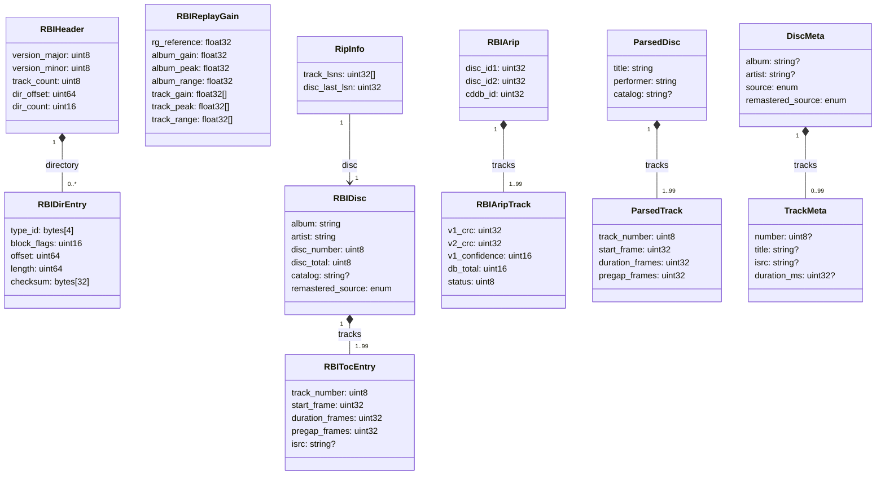

# Data Model

> **Purpose**: Language-agnostic definitions of every struct that crosses a module boundary in cdda2img. Define your data layout from this document before implementing any individual module.

## Overview

There are three natural struct groups:

- **Container format** — structs that map to regions of the RBI binary file (`RBIHeader`, `RBIDirEntry`, `RBIDisc`, `RBITocEntry`, `RBIReplayGain`, `RBIArip`, `RBIAripTrack`)
- **Pipeline boundaries** — structs passed between major pipeline stages (`RipInfo`, `ParsedDisc`, `ParsedTrack`)
- **Metadata** — structs produced by remote lookup sources and consumed by the metadata confirmation menu (`DiscMeta`, `TrackMeta`)

`RBIDisc` is the central struct. It is built up incrementally as the pipeline runs: the rip/import stage populates timing; the metadata stage populates album/artist/ISRC; the TOC generator and container builder read from it at the end. `RBIHeader` and `RBIDirEntry` are only needed by the container reader; they are not used during writing.

## Constants

All implementations must define these before working with the structs below.

| Name | Value | Meaning |
|------|-------|---------|
| `CD_FRAMES_PER_SECOND` | 75 | CD sectors per second (Red Book) |
| `PCM_SAMPLE_RATE` | 44 100 | Hz |
| `PCM_CHANNELS` | 2 | stereo |
| `PCM_BIT_DEPTH` | 16 | bits per sample; signed, little-endian |
| `BYTES_PER_FRAME` | 2 352 | 588 stereo sample pairs × 4 bytes |
| `MAX_TRACKS` | 99 | Red Book §3.1.2 |
| `MAX_RUNTIME_SECONDS` | 4 800 | 80 minutes |
| `HEADER_FIXED_SIZE` | 40 | bytes |
| `DIR_ENTRY_SIZE` | 54 | bytes per block directory entry |
| `RG_BLOCK_FIXED_SIZE` | 17 | bytes (precedes per-track arrays) |
| `RG_TRACK_SIZE` | 12 | bytes per track in RGDB block (3 × float32) |
| `ARIP_HEADER_SIZE` | 13 | bytes |
| `ARIP_TRACK_SIZE` | 15 | bytes per track in ARIP block |

### Frame arithmetic

```
byte_offset  = frame_count × 2352
frame_count  = byte_offset ÷ 2352       // must divide evenly for a valid frame boundary
seconds      = frame_count ÷ 75
MM:SS:FF     = (frame_count ÷ 4500,
                (frame_count ÷ 75) mod 60,
                frame_count mod 75)
```

All `start_frame`, `duration_frames`, and `pregap_frames` fields throughout the codebase are in **CD frames**, not bytes and not seconds. Convert to bytes only at the point of PCM block I/O.

## Relationships



## Struct Definitions

TypeScript-style pseudocode. `uint8` / `uint16` / `uint32` / `uint64` are unsigned integers of the specified width. `float32` is IEEE 754 single precision. All binary fields are **little-endian**. `T?` means the field may be absent (null / None / Option\<T\>); `T` means it is always present.

---

### Container format

#### `RBIHeader`

Parsed form of the 40-byte binary header at byte offset 0 of every RBI file. Always read first; use `dir_offset` to seek to the block directory.

```typescript
interface RBIHeader {
  version_major: uint8    // must equal 4
  version_minor: uint8    // must equal 0
  flags: uint32           // bitmask; bit 2 = master-mode flag; all other bits reserved
  track_count: uint8      // 1–99
  disc_number: uint8      // 1-based position in a multi-disc set
  disc_total: uint8       // total discs in the set; ≥ disc_number
  pcm_sample_rate: uint32 // must equal 44100
  pcm_channels: uint8     // must equal 2
  pcm_bit_depth: uint8    // must equal 16
  dir_offset: uint64      // byte offset from file start to block directory
  dir_count: uint16       // number of RBIDirEntry records in the directory
  directory: RBIDirEntry[] // in-memory only; length = dir_count
}
```

Binary layout (40 bytes, little-endian):

```
offset  size  type    field
     0     8  bytes   magic: b'RBIMAGE\x00'
     8     1  uint8   version_major
     9     1  uint8   version_minor
    10     4  uint32  flags
    14     1  uint8   track_count
    15     1  uint8   disc_number
    16     1  uint8   disc_total
    17     4  uint32  pcm_sample_rate
    21     1  uint8   pcm_channels
    22     1  uint8   pcm_bit_depth
    23     8  uint64  dir_offset
    31     2  uint16  dir_count
    33     7  bytes   reserved (all zeros)
```

---

#### `RBIDirEntry`

One record in the block directory. The directory begins at `dir_offset`; each entry is 54 bytes.

```typescript
interface RBIDirEntry {
  type_id: bytes[4]    // b'TOC ', b'PCM ', b'RGDB', b'ARIP', b'PROV', b'RLOG', b'CTDB'
  block_flags: uint16  // bit 0 = skippable (reader may ignore if type is unrecognised)
  offset: uint64       // byte offset from file start to the block's first byte
  length: uint64       // byte length of the block
  checksum: bytes[32]  // SHA-256 of the block content
}
```

Binary layout (54 bytes, little-endian):

```
offset  size  type    field
     0     4  bytes   type_id
     4     2  uint16  block_flags
     6     8  uint64  offset
    14     8  uint64  length
    22    32  bytes   checksum (SHA-256)
```

A reader that encounters an unrecognised `type_id` with `block_flags & 0x0001 == 0` **must** treat the file as unreadable. If `block_flags & 0x0001 == 1`, the block may be skipped.

---

#### `RBIDisc`

The central in-memory representation of a disc. Built up across pipeline stages. Drives TOC generation and container building.

```typescript
interface RBIDisc {
  album: string                   // non-empty; confirmed by metadata menu
  artist: string                  // non-empty; confirmed by metadata menu
  disc_number: uint8              // 1-based; 1 for single-disc releases
  disc_total: uint8               // ≥ disc_number; 1 for single-disc releases
  catalog: string?                // MCN: exactly 13 decimal digits; null if absent
  disc_id: string?                // PTI 0x86 catalogue/label reference; null if absent
  tracks: RBITocEntry[]           // 1–99 entries in disc order
  release_date: string?           // "YYYY", "YYYY-MM", or "YYYY-MM-DD"
  original_release_date: string?  // release-group first-release date
  remastered_source: "UNKNOWN" | "NO" | "POSSIBLE" | "YES"
  mb_release_id: string?          // MusicBrainz release UUID (hyphenated 8-4-4-4-12 form)
  set_title: string?              // box set title when this disc has its own album title
}
```

---

#### `RBITocEntry`

One track's timing and identity data. All frame fields are in CD frames (1/75 s). Multiply by 2352 for byte offset into the PCM block.

```typescript
interface RBITocEntry {
  track_number: uint8      // 1-based; 1–99
  title: string            // sanitised track title; non-empty after metadata menu
  performer: string        // track-level performer; may equal disc artist
  start_frame: uint32      // CD frame index to start of pregap (or audio if no pregap)
  duration_frames: uint32  // audio-only duration in CD frames; excludes pregap
  pregap_frames: uint32    // pregap duration in CD frames; 0 if no pregap
  isrc: string?            // ISO 3901: 12 chars, no hyphens (e.g. "GBAYE9200087"); null if absent
}
```

Derived values (not stored; compute on demand):

```
audio_start_frame = start_frame + pregap_frames
audio_start_bytes = audio_start_frame × 2352
slot_frames       = pregap_frames + duration_frames   // total FILE entry length in the TOC
duration_seconds  = duration_frames ÷ 75
```

---

#### `RBIReplayGain`

EBU R128 loudness data. Stored in the RGDB block. The three per-track arrays each have exactly `track_count` elements in disc order.

```typescript
interface RBIReplayGain {
  rg_version: uint8      // current value: 1
  rg_reference: float32  // LUFS; nominally −18.0
  album_gain: float32    // dB (positive = boost, negative = cut)
  album_peak: float32    // linear peak (> 1.0 = clipping)
  album_range: float32   // LU (loudness range)
  track_gain: float32[]  // dB per track; length = track_count
  track_peak: float32[]  // linear peak per track; length = track_count
  track_range: float32[] // LU per track; length = track_count
}
```

RGDB block binary layout:

```
offset      size  content
     0         1  rg_version (uint8)
     1         4  rg_reference (float32 LE)
     5         4  album_gain (float32 LE)
     9         4  album_peak (float32 LE)
    13         4  album_range (float32 LE)
    17   12 × N  per-track: [gain(f32 LE), peak(f32 LE), range(f32 LE)] × N tracks
```

---

#### `RBIArip` / `RBIAripTrack`

AccurateRip verification results. Stored in the ARIP block when verification was performed.

```typescript
interface RBIArip {
  arip_version: uint8      // current value: 1
  disc_id1: uint32         // AccurateRip disc ID 1 (sum of track LSNs + lead-out LSN)
  disc_id2: uint32         // AccurateRip disc ID 2 (weighted sum; LSN=0 treated as 1)
  cddb_id: uint32          // CDDB disc ID (used in AccurateRip URL construction)
  tracks: RBIAripTrack[]   // one entry per track; length = track_count
}

interface RBIAripTrack {
  v1_crc: uint32          // computed AccurateRip v1 CRC; 0 if disc not in database
  v2_crc: uint32          // computed AccurateRip v2 CRC; 0 if disc not in database
  v1_confidence: uint16   // count of submissions matching this v1 CRC; 0 = no match
  v2_confidence: uint16   // count of submissions matching this v2 CRC; 0 = no match
  db_total: uint16        // total AR submissions for this track across all offset groups
  status: uint8           // 0 = NOT_IN_DB, 1 = MISMATCH, 2 = OK
}
```

ARIP block binary layout:

```
offset      size  content
     0         1  arip_version (uint8)
     1         4  disc_id1 (uint32 LE)
     5         4  disc_id2 (uint32 LE)
     9         4  cddb_id (uint32 LE)
    13   15 × N  per-track: [v1_crc(u32), v2_crc(u32), v1_conf(u16), v2_conf(u16), db_total(u16), status(u8)] × N
```

---

### Pipeline boundaries

#### `RipInfo`

Returned by both rip paths (cdrdao primary, cd-paranoia fallback). Carries the disc skeleton and the raw LSN data needed for CDDB and AccurateRip disc ID computation.

```typescript
interface RipInfo {
  disc: RBIDisc          // skeleton disc: timing populated; metadata fields empty or from CD-Text
  track_lsns: uint32[]   // absolute first LSN for each track (index 0 = track 1)
  disc_last_lsn: uint32  // last LSN of the final audio track (not lead-out)
}
```

Invariants:
- `track_lsns.length` equals `disc.tracks.length`
- `track_lsns[0]` is 0 for discs with no pre-gap offset (the common case)
- `disc_last_lsn` ≥ `track_lsns[last]`

---

#### `ParsedDisc` / `ParsedTrack`

Returned by the TOC text parser. Used internally to build `RBIDisc`; not stored in the container. Fields map directly to `RBIDisc` / `RBITocEntry` but `title` and `performer` may be empty strings (not yet confirmed by the metadata menu).

```typescript
interface ParsedDisc {
  title: string      // from TITLE field in the disc header section; may be empty
  performer: string  // from PERFORMER field in the disc header section; may be empty
  catalog: string?   // MCN; null if absent or all-zero ("0000000000000")
  disc_id: string?   // PTI 0x86 value; null if absent
  tracks: ParsedTrack[]
}

interface ParsedTrack {
  track_number: uint8
  title: string         // from TITLE field; may be empty
  performer: string     // track-level or inherited from disc; may be empty
  start_frame: uint32   // CD frame index to pregap start (or audio start if no pregap)
  duration_frames: uint32  // audio-only frames; excludes pregap
  pregap_frames: uint32    // 0 if no pregap
  isrc: string?
}
```

Derived value (not stored):

```
audio_start_frame = start_frame + pregap_frames
```

---

### Metadata

#### `DiscMeta` / `TrackMeta`

Produced by all four lookup sources (CDDB, MusicBrainz, AcoustID, Discogs) and by CD-Text extraction. All fields except `source` and `remastered_source` are optional — any individual lookup may return partial data.

```typescript
interface DiscMeta {
  album: string?
  artist: string?
  catalog: string?                  // MCN / EAN-13 / barcode
  mb_disc_id: string?               // SHA-1 disc ID, base64url-encoded, 28 chars
  mb_release_id: string?            // MusicBrainz release UUID (hyphenated)
  mb_release_group_id: string?      // MusicBrainz release group UUID
  discogs_release_id: uint32?       // Discogs integer release ID
  release_date: string?             // "YYYY", "YYYY-MM", or "YYYY-MM-DD"
  original_release_date: string?    // release-group first-release date
  country: string?                  // ISO 3166-1 alpha-2 (e.g. "GB", "US")
  label: string?                    // record label name
  catalog_number: string?           // label catalogue number (e.g. "XYZ-001")
  disc_number: uint8?               // 1-based; null = unknown
  disc_total: uint8?                // null = unknown
  set_title: string?                // box set title when disc has its own album title
  remastered_source: "UNKNOWN" | "NO" | "POSSIBLE" | "YES"
  source: "cdtext" | "embedded" | "cddb" | "musicbrainz" | "acoustid" | "discogs" | "manual"
  tracks: TrackMeta[]               // empty if source did not return track-level data
}

interface TrackMeta {
  number: uint8?       // 1-based; null if source did not provide
  title: string?
  performer: string?   // track-level performer; null if same as disc artist or unknown
  isrc: string?        // 12 chars, no hyphens
  duration_ms: uint32? // from MusicBrainz only; for track-length verification against TOC
}
```

#### Merge rule for `DiscMeta`

When two `DiscMeta` values are merged (base priority over update), the result follows:

1. Any non-null scalar field from `base` is kept; null fields are filled from `update`.
2. `tracks`: use `base.tracks` if non-empty; otherwise use `update.tracks`.
3. `remastered_source`: keep `base` value unless it is `"UNKNOWN"`, in which case use `update`.
4. `source`: always keep `base.source` — the earlier, higher-priority source wins.

---

## Lifecycle of `RBIDisc`

Timing fields are populated first; metadata fields are filled in later. Consumers of `RBIDisc` at any pipeline stage may see null or empty metadata fields and must tolerate them.

| Stage | What is populated |
|-------|------------------|
| Rip / import | `tracks[*].start_frame`, `duration_frames`, `pregap_frames`; optionally `catalog`, `disc_id`, `tracks[*].isrc`, `album`, `artist`, `tracks[*].title` from CD-Text or foreign format metadata |
| CDDB lookup (rip pipeline only) | `album`, `artist`, `tracks[*].title` — if CD-Text was absent |
| MusicBrainz lookup | `mb_release_id`, `release_date`, `original_release_date`, `set_title`, `tracks[*].title`, `tracks[*].isrc` — auto-applied if exactly one release matches |
| Metadata menu | All fields confirmed or overridden by the user; AcoustID and Discogs results merged interactively |
| TOC generator | Reads `tracks`, `catalog`, `disc_id`, `album`, `artist` — all fields must be final |
| Container builder | Reads the fully populated `RBIDisc` — writes all blocks |

For the **Create pipeline** (audio files → container), there is no rip step. `tracks[*].start_frame` and `duration_frames` are derived from the transcoded WAV files; `album` and `artist` are seeded from embedded file tags.
