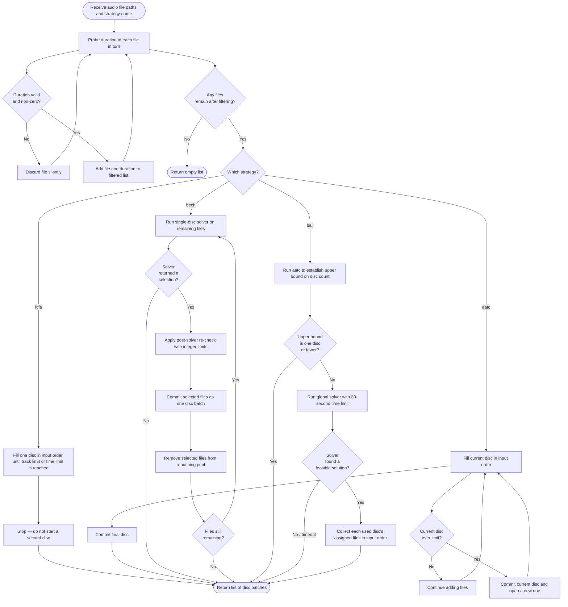

# Input Selector

> **Purpose**: Groups a list of audio files into CD-sized batches using one of four strategies, enforcing Red Book hard limits on track count and total running time.

## Overview

This module sits at the entry point of the Create pipeline. It receives an ordered list of audio file paths and a chosen batching strategy name, probes each file to measure its audio duration, discards any files whose duration cannot be measured or is zero, and then assigns the remaining files to one or more disc batches. Each batch represents exactly one disc and must not exceed 99 tracks or 80 minutes of total audio. The module produces an ordered list of batches, where each batch is an ordered list of file paths.

Two strategies operate greedily in a single pass. Two strategies use constraint programming: one optimises each disc independently in sequence, the other solves the global assignment across all discs simultaneously. All four strategies operate on the same filtered, duration-probed input and produce the same output shape.

## Invariants and Constraints

- **Hard track limit**: no batch may contain more than 99 tracks. This is the Red Book maximum.
- **Hard duration limit**: no batch may exceed 80 minutes of total audio. This is the Red Book maximum programme area.
- **Integer scaling rule (critical)**: all duration arithmetic used for capacity comparisons and constraint-solver models converts minutes to scaled integers by multiplying by 100 and taking the ceiling (rounding up). Using `floor` or `round` would allow a duration of 79.999 minutes to pass a ≤80 check when the true duration is above the limit. The ceiling guarantees conservative packing. The capacity bound (80 × 100 = 8000) uses exact integer multiplication, not ceiling, because 80 is an exact value.
- **Zero-duration files are discarded before batching**: a file whose duration cannot be probed, or whose probed duration is exactly zero, is silently dropped. It never appears in any output batch.
- **If all files are discarded, the result is an empty list**: the caller must check for an empty result and handle it — no batch is produced.
- **Input file order is preserved within each disc**: whichever files land on a given disc appear in the same relative order as they appeared in the input. The constraint-programming strategies may distribute files across discs non-contiguously, but do not reorder files within a disc.
- **`fcfs` always returns exactly one batch**: the first-come-first-served strategy fills one disc and stops, even if there are remaining files that would fit on a second disc. The caller receives a single-element list of batches.
- **`aatc` places every valid file**: the all-at-to-capacity strategy continues opening new discs until every valid file has been assigned. No valid file is dropped. Note: if a single file's duration alone exceeds 80 minutes, it will be placed alone on its own disc (without an overflow check on that disc), preceded by whatever triggered the disc boundary. This is a known edge case.
- **`bech` may silently drop remaining files on solver failure**: if the single-disc constraint solver returns no feasible selection for the remaining files, the loop terminates early and any un-batched files are not assigned. The caller receives only the batches completed up to that point.
- **`ball` falls back to `aatc` on solver failure or timeout**: the global solver has a 30-second time limit. If it does not return an optimal or feasible solution within that limit, the result of `aatc` (computed as an upper bound before the solver runs) is returned instead. If `aatc` already produces one disc or fewer, the solver is skipped entirely.
- **An unknown strategy name is a hard error**: the module raises an error immediately. The caller must supply a valid strategy name.
- **Duration values are in minutes throughout**: probed durations are stored and compared in minutes (not seconds or frames).

## Data Shapes

| Direction | Shape | Notes |
|-----------|-------|-------|
| Input — file list | An ordered sequence of audio file paths | Each path must point to an audio file whose stream can be opened and duration probed. Files that fail probing are silently excluded. |
| Input — strategy | A single identifier: one of `fcfs`, `aatc`, `bech`, or `ball` | Any other value triggers an immediate error. |
| Internal — duration | A fractional number of minutes, derived from the audio stream's duration divided by 60 | Used directly for greedy comparisons; converted to a scaled integer (× 100, ceiling) for constraint-solver models. |
| Output | An ordered list of batches; each batch is an ordered list of audio file paths | At most 99 paths per batch; total audio duration of all files in a batch is at most 80 minutes. The outer list may be empty if no valid files were supplied. |

## Error Handling

| Failure | Trigger | Response | Caller receives |
|---------|---------|----------|-----------------|
| Unreadable or invalid audio file | Any error raised while probing the file's audio stream | Silent — the probed duration is treated as zero | File is excluded from all batches; no error is raised |
| All files unreadable or zero-duration | Every file yields a zero duration | Early return after filtering | An empty list `[]` |
| Unknown strategy name | Strategy identifier not in the set `{fcfs, aatc, bech, ball}` | Raises an error with the unknown strategy name in the message | Error propagates to caller |
| Single-disc solver produces no selection (`bech`) | Constraint solver returns no optimal or feasible result for the remaining files | The batching loop terminates; remaining files are silently abandoned | Only the batches completed before the failure; remaining files are not returned |
| Global solver times out or finds no solution (`ball`) | 30-second solver time limit exceeded, or problem is infeasible | Falls back to the `aatc` result that was computed as an upper bound | `aatc` batches, not an error |

## Algorithm Notes

### Greedy strategies (`fcfs` and `aatc`)

Both greedy strategies iterate the filtered file list in input order and maintain a running total of duration (in fractional minutes) and a running count of tracks for the current disc. A file is added to the current disc if doing so would not push either the track count above 99 or the total duration above 80 minutes. The floating-point comparison `total + next_duration > 80` is used here (not scaled integers) because greedy strategies do not face the bin-packing drift problem — they add one file at a time and the accumulated error across a single disc is negligible.

`fcfs` places files into a single disc batch until capacity is reached, then stops. Files that did not fit are returned to the caller as unplaced; the caller receives a list containing exactly one batch.

`aatc` instead starts a new disc when the current disc is full, and continues until all files are placed. Every valid file appears in exactly one batch.

### Single-disc knapsack (`bech`)

The `bech` strategy applies a single-disc constraint solver repeatedly. Each iteration selects the best subset of the remaining unassigned files to fill one disc, removes those files from the pool, and then repeats for the next disc. It terminates when all files are assigned or when the solver cannot select any files from what remains.

**Formulation:**
- **Input representation**: each file's duration is multiplied by 100 and rounded up to the nearest integer (ceiling). The disc capacity is 80 × 100 = 8000 scaled integer units.
- **Decision variables**: one boolean indicator per remaining file — included on this disc (1) or not (0).
- **Objective**: maximise the total scaled duration of selected files.
- **Constraints**:
  - Total scaled duration of selected files ≤ 8000.
  - Count of selected files ≤ 99.
- **Post-solver safety re-check**: after the solver returns a selection, the module re-applies the same integer capacity and track-count constraints by iterating the selected indices in order. Any item that would push the total over a limit in the re-check is excluded. This guards against any solver floating-point residual that might cause a near-limit solution to slightly exceed the bound when re-evaluated.
- **On no feasible solution**: the batch loop breaks immediately; remaining files are not assigned.
- **Track order within disc**: the selected files are placed in the output batch in the same order they appeared in the remaining pool (i.e., preserving relative input order).

### Global bin-packing (`ball`)

The `ball` strategy solves a complete bin-packing problem across all files and all candidate discs simultaneously, aiming to minimise the total number of discs used.

**Pre-step — upper bound**: `aatc` is run first. The number of discs it produces is the upper bound on how many discs the solver may use. If `aatc` produces one disc or fewer, `ball` returns that result directly without invoking the solver.

**Formulation:**
- **Input representation**: each file's duration is multiplied by 100 and rounded up to the nearest integer (ceiling). The disc capacity is 80 × 100 = 8000 scaled integer units.
- **Decision variables**:
  - One boolean "disc used" indicator per candidate disc (up to `aatc`-count discs).
  - One boolean "file assigned to disc" indicator per (file, disc) pair — a matrix of N files × D discs.
- **Objective**: minimise the total number of discs whose "disc used" indicator is 1.
- **Constraints**:
  - Each file is assigned to exactly one disc (the sum of its assignment indicators across all discs equals 1).
  - For each disc: total scaled duration of assigned files ≤ 8000.
  - For each disc: count of assigned files ≤ 99.
  - For each (file, disc) pair: a file may only be assigned to a disc that is marked as used (assignment ≤ used-disc indicator).
  - Symmetry-breaking: used-disc indicators are non-increasing from disc 0 to disc D−1 (used discs are packed toward lower indices). This eliminates symmetric solutions that differ only by permuting empty discs, which significantly reduces solver search time.
- **Time limit**: 30 seconds. If the solver does not produce a feasible or optimal solution within this limit, the `aatc` result is returned.
- **On timeout or infeasible**: returns the `aatc` upper bound; no error is raised.
- **Track order within disc**: files in each disc's output batch appear in the same relative order as they appeared in the original input (the solver matrix is iterated in input-file index order when collecting each disc's contents).

## Pipeline Flowchart

## Step Descriptions

1. **Receive audio file paths and strategy name** — Entry point. Accepts an ordered list of file paths and a strategy identifier.
2. **Probe duration of each file in turn** — Opens each audio file, locates its audio stream, and reads the stream's duration in seconds, then converts to minutes. Any error causes the duration to be recorded as zero.
3. **Duration valid and non-zero?** — Files with a zero or unmeasurable duration are filtered out.
4. **Discard file silently** — The file is removed from consideration. No warning is emitted to the caller.
5. **Add file and duration to filtered list** — Valid files and their durations are retained for batching.
6. **Any files remain after filtering?** — If the filtered list is empty, the module exits immediately.
7. **Return empty list** — No batches produced; the caller receives `[]`.
8. **Which strategy?** — Dispatch to one of four batching paths.
9. **Fill one disc in input order until track limit or time limit is reached** (`fcfs`) — Append files to the single disc batch, stopping as soon as adding the next file would exceed 99 tracks or 80 minutes.
10. **Stop — do not start a second disc** (`fcfs`) — Any remaining files are left unassigned. The caller receives exactly one batch.
11. **Fill current disc in input order** (`aatc`) — Append files sequentially to the current disc batch.
12. **Current disc over limit?** (`aatc`) — Check whether the next file would push track count above 99 or total duration above 80 minutes.
13. **Continue adding files** (`aatc`) — The file fits; add it and check the next.
14. **Commit current disc and open a new one** (`aatc`) — The current batch is saved; a fresh batch begins with the file that did not fit on the previous disc.
15. **Commit final disc** (`aatc`) — The last (possibly partial) batch is appended to the result.
16. **Run single-disc solver on remaining files** (`bech`) — A constraint-programming model is constructed with one boolean decision variable per remaining file. The solver maximises total scaled duration subject to the scaled capacity and track-count constraints.
17. **Solver returned a selection?** (`bech`) — If the solver finds no feasible solution, the loop terminates.
18. **Apply post-solver re-check with integer limits** (`bech`) — The solver's selection is re-validated in input order using integer scaled arithmetic to guard against near-limit rounding artefacts.
19. **Commit selected files as one disc batch** (`bech`) — The files that passed the re-check are saved as one disc's batch, in their original relative order.
20. **Remove selected files from remaining pool** (`bech`) — Selected files are excluded from future solver iterations.
21. **Files still remaining?** (`bech`) — If any files are unassigned, repeat from step 16.
22. **Run aatc to establish upper bound on disc count** (`ball`) — `aatc` is run on the full file list. Its output establishes the maximum number of discs the solver needs to consider.
23. **Upper bound is one disc or fewer?** (`ball`) — If `aatc` already fits everything on one disc, no solver is needed.
24. **Run global solver with 30-second time limit** (`ball`) — The bin-packing model assigns every file to exactly one disc, with the objective of minimising the number of used discs.
25. **Solver found a feasible solution?** (`ball`) — On timeout or infeasibility, the `aatc` result is returned.
26. **Collect each used disc's assigned files in input order** (`ball`) — For each disc whose used-indicator is 1, the module gathers assigned files in original input-index order and appends the batch to the result.
27. **Return list of disc batches** — Common exit point for all four strategies. The result is a list (possibly empty) of batches, each itself an ordered list of file paths.

## Inputs and Outputs

| Direction | Description |
|-----------|-------------|
| Input | An ordered list of audio file paths, plus a strategy name. The files may be in any audio format that the audio-probing component can open. |
| Output | An ordered list of batches. Each batch is an ordered list of file paths representing the tracks for one disc. The list may be empty if no files passed duration validation. |

## Connects To

- **`cdda2img.py` — Create pipeline entry point**: calls this module to obtain batches, then processes each batch through transcoding, silence trimming, concatenation, metadata derivation, TOC generation, loudness analysis, and container building.
- **Audio metadata probe** (internal to this module): each file is opened to read its audio stream duration. Any format the probe component supports is accepted; unsupported files are silently dropped.
- **Constraint programming solver** (internal to this module, `bech` and `ball` only): a constraint model is built and solved to find optimal or near-optimal disc assignments. The solver is not invoked by `fcfs` or `aatc`.
- **`transcode.py`**: each batch produced by this module is passed to the transcoding step, which converts every file in the batch to Red Book PCM WAV.
