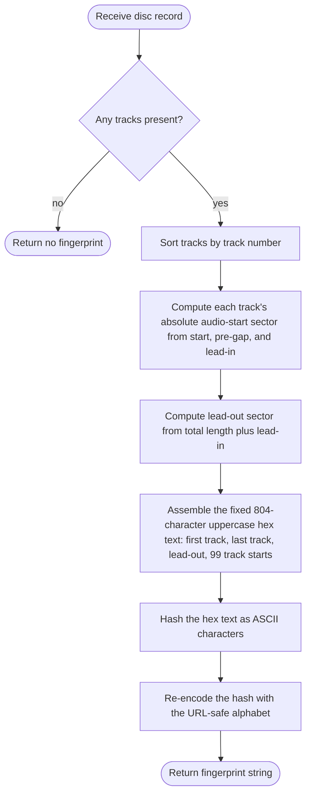
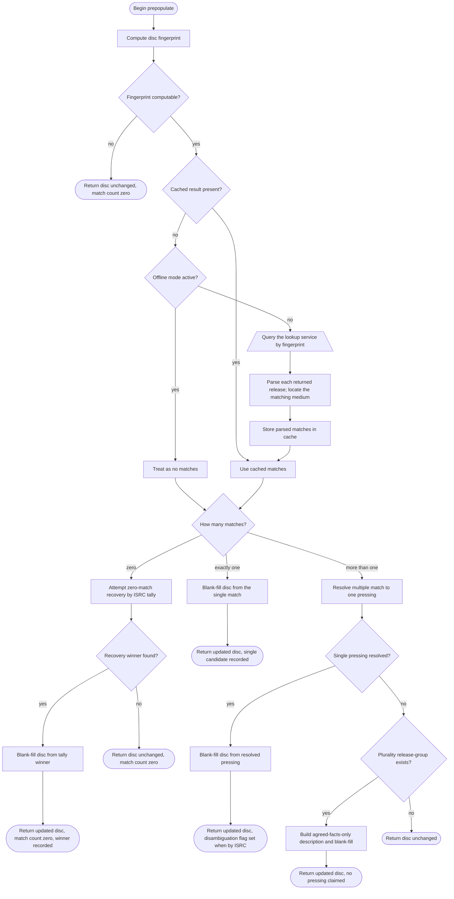
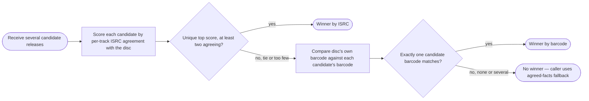

# MusicBrainz Metadata Lookup

> **Purpose**: Identify the disc against the MusicBrainz metadata service and fill in missing album, artist, track-title, ISRC, barcode, and release-grouping facts — without ever guessing a specific pressing it cannot prove.

## Overview

This module turns a disc's table-of-contents fingerprint into a metadata enrichment step. It computes a disc fingerprint from the track layout, asks the MusicBrainz service which releases share that fingerprint, and then decides — carefully — how much of the returned metadata it is safe to commit to the disc record. When the fingerprint matches exactly one release, the module fills in blank fields and stops. When it matches several releases, the module attempts to single out one pressing using independent per-track evidence; if it cannot, it deliberately commits only the facts that *every* candidate agrees on, leaving everything pressing-specific blank rather than fabricating it. When the fingerprint matches nothing, a last-resort path tallies per-track recording lookups to recover a likely release. The module also offers text search, barcode search, single-release fetch, and release-group browsing used by other parts of the pipeline and by the interactive menu.

## Invariants and Constraints

- **Disc fingerprint input is text, not raw numbers.** The fingerprint is computed over an 804-character uppercase-hexadecimal ASCII string, then hashed, then re-encoded. Hashing the underlying binary numbers directly instead of their hex *text* produces a plausible-looking but permanently non-matching fingerprint. This is a known silent-failure trap that has caused a real defect before — any reimplementation must hash the ASCII hex characters.
- **Fingerprint string layout is fixed**: first track number (2 hex chars), last track number (2 hex chars), lead-out position (8 hex chars, zero-padded), then exactly 99 track-start positions (8 hex chars each, zero-padded; unused slots are zero). All positions are absolute sector addresses; track one conventionally begins at sector 150 (the standard two-second lead-in).
- **Re-encoding uses a URL-safe alphabet**: after hashing, the result is base-encoded and three characters are substituted so the fingerprint is safe in a web address.
- **The committed release identity must be the fingerprint-matched release.** When a single or disambiguated fingerprint match is committed, the stored release identifier and release-group identifier come from that matched release. (See Logic observations for one path — the zero-match recovery — that populates a release identifier from a release that was *not* fingerprint-matched.)
- **Never claim a specific pressing without proof.** On an unresolved multiple-match, the module must not adopt any one candidate's pressing-specific facts (exact date, country, catalogue number, release identifier). It may adopt only album-level facts on which every candidate agrees.
- **Blank-fill never overwrites.** The default merge fills only fields the disc has left empty or marked "Unknown Artist"; an existing disc value always wins. A separate overwrite merge exists for an explicit user "overwrite all" choice.
- **ISRC values are structure-checked at two chokepoints**: once when first read from the service, and again when merging a raw-side ISRC from a foreign image. Malformed values are dropped (with a warning), never propagated.
- **Per-track durations come from the medium's own track length, never the shared canonical recording length.** The canonical recording length can come from a different pressing and be off by seconds, which would falsely fail the downstream runtime check. A missing track length leaves duration unknown so the downstream check skips rather than compares against the wrong value.
- **Multiple-match disambiguation by per-track ISRC requires a strict, unique winner** scoring at least two agreeing tracks. A tie at the top score, or a top score below two, yields no winner.
- **Zero-match recovery by ISRC tally requires at least three ISRC-bearing tracks, a strictly unique top release, and convergence across at least half the ISRC-bearing tracks.** Below any of these thresholds it yields nothing.
- **The request rate to the service is pinned to one request per second** so the project does not silently inherit a future library default.
- **Offline mode short-circuits every network path** but still reads the local cache; fingerprint lookups and recording lookups remain usable offline from cache.
- **Fingerprint lookups are cached with a thirty-day expiry, including empty results** (a fingerprint unknown today is almost certainly unknown tomorrow). Recording-by-ISRC lookups are cached with no expiry (the binding is immutable in practice). Any cache failure degrades silently to a live request.

## Data Shapes

| Direction | Shape | Notes |
|-----------|-------|-------|
| Input | A disc record: ordered tracks each carrying a number, start position (in 75 Hz frames), pre-gap length, optional title, optional performer, optional ISRC; plus disc-level album, artist, catalogue/barcode, disc number/total. | Track positions are converted to absolute sector addresses (frames) for the fingerprint. |
| Input | A disc fingerprint string (computed internally), an ISRC string, a release identifier, a release-group identifier, a text query, or a barcode — depending on which entry point is called. | |
| Output | A list (or single instance) of parsed release descriptions: album, artist, normalised barcode, release identifier, release-group identifier, release date, earliest-release date, country, label, catalogue number, disc number/total, set title, and a track list (number, title, performer, ISRC, duration in milliseconds). | Empty list / null on no match, error, or offline-with-cache-miss. |
| Output | An aggregate result of the prepopulate step: the (possibly updated) disc record, a list of (release identifier, barcode) hints from every match, the total match count, a flag for whether ISRC disambiguation fired, the chosen candidate's album/artist, and the winning candidate description. | The match count of zero distinguishes "service does not know this disc" from later ambiguity. |

## Fingerprint Computation Flowchart

## Fingerprint Lookup and Prepopulate Flowchart

## Multiple-Match Resolution Flowchart

## Step Descriptions

### Fingerprint Computation
1. **Receive disc record** — the disc whose layout will be fingerprinted.
2. **Any tracks present?** — a disc with no tracks cannot be fingerprinted.
3. **Sort tracks by track number** — fingerprint inputs must be in track order.
4. **Compute each track's absolute audio-start sector** — combine the track's start, its pre-gap, and the standard lead-in to get the absolute sector where its audio begins.
5. **Compute lead-out sector** — total disc length plus the lead-in.
6. **Assemble the fixed 804-character hex text** — first track, last track, lead-out, then 99 track-start slots (unused slots zero).
7. **Hash the hex text as ASCII characters** — the hash is taken over the text, not the underlying numbers (see Invariants).
8. **Re-encode with the URL-safe alphabet** — produce the web-safe fingerprint string.

### Fingerprint Lookup and Prepopulate
1. **Compute disc fingerprint** — as above.
2. **Fingerprint computable?** — abort early if the disc has no tracks.
3. **Cached result present?** — a cache hit short-circuits all network work, online or offline.
4. **Offline mode active?** — on a cache miss while offline, treat the result as no matches.
5. **Query the lookup service by fingerprint** — request artists, recordings, release-groups, labels, and ISRCs in one call. Errors are treated as no matches.
6. **Parse each returned release; locate the matching medium** — for each release, find the specific medium whose disc list contains this fingerprint, so only that disc's tracks are read.
7. **Store parsed matches in cache** — including the empty case.
8. **How many matches?** — branches the logic three ways.
9. **Zero-match recovery by ISRC tally** — see Algorithm Notes; fires only with enough ISRC-bearing tracks.
10. **Blank-fill disc from the single match** — fill only empty fields.
11. **Resolve multiple match to one pressing** — try ISRC agreement, then barcode (see resolution flowchart).
12. **Plurality release-group exists?** — when no single pressing resolves, check whether the candidates agree on one release-group by a unique majority.
13. **Build agreed-facts-only description** — synthesise the safe shared facts and blank-fill.

### Multiple-Match Resolution
1. **Score each candidate by per-track ISRC agreement** — count tracks where both the disc and the candidate carry the same ISRC.
2. **Unique top score, at least two agreeing?** — a strict unique winner above the floor wins.
3. **Compare disc's own barcode against each candidate's barcode** — used only when ISRC scoring is inconclusive.
4. **Exactly one candidate barcode matches?** — a unique barcode hit wins; several matches (a barcode shared across country variants) is treated as undetermined.

## Error Handling

| Failure | Trigger | Response | Caller receives |
|---------|---------|----------|-----------------|
| No tracks | Disc has no tracks | Skip fingerprint | Null fingerprint / disc unchanged, match count zero |
| Service response error | Lookup service rejects the request | Log at debug, treat as no matches | Empty list |
| Network error | No connectivity during a live call | Log at debug, treat as no matches | Empty list |
| Offline with cache miss | Offline mode active and not cached | Skip network entirely | Empty list / null |
| Malformed ISRC from service | ISRC fails structure check at ingress | Drop the value, log warning | Track with no ISRC |
| Malformed raw-side ISRC at merge | Foreign-image ISRC fails structure check | Drop it, fall back to service-side ISRC | Track with the validated ISRC or none |
| Barcode fails normalisation | Returned barcode is not a valid checked code | Drop it, log informational | Release with no barcode |
| Ambiguous multiple match | Several releases, none uniquely resolvable | Commit only agreed facts, claim no pressing | Disc with album-level facts only |
| Single-release fetch fails | Service error or empty release | Return null | Null |

## Algorithm Notes

### Disc fingerprint
- **Objective**: derive a deterministic identifier that the metadata service can index by, identical to the one the service itself stores.
- **Decision/derivation**: from the sorted track layout, build the fixed 804-character hex text described in Invariants.
- **Constraints**: exactly 99 track-start slots; unused slots zero; positions are absolute sector addresses including the lead-in; the hash is over the hex *text*.
- **Steps**: assemble text → hash → re-encode with the URL-safe alphabet (three character substitutions).

### Multiple-match ISRC disambiguation
- **Objective**: pick the one pressing whose recordings best match the physical disc, using evidence already in hand (no extra lookups).
- **Decision**: for each candidate, count track numbers where both sides carry the *same* ISRC.
- **Constraints**: the top score must be unique (strictly higher than the runner-up) and at least two; otherwise no winner.
- **Tie-breaking**: a tie at the top score yields no winner — the module prefers a correctable blank over a confident guess.

### Multiple-match barcode disambiguation
- **Objective**: identify the exact pressing from the disc's own catalogue/barcode number read from the disc.
- **Decision**: normalise the disc barcode and find candidates whose normalised barcode equals it.
- **Constraints**: a *unique* match wins; several matches (a barcode shared across country variants) is treated as undetermined → no winner.

### Zero-match recovery by ISRC tally
- **Objective**: recover a likely release when the fingerprint matched nothing, using per-track recording lookups.
- **Decision variables**: for each ISRC-bearing track, look up the recording, collect the releases it appears on, and tally release occurrences across all tracks.
- **Constraints**: at least three ISRC-bearing tracks; the winning release must appear for at least half the ISRC-bearing tracks (and never fewer than three); the top tally must be strictly unique.
- **Cost**: one sequential lookup per ISRC at one request per second.
- **Tie-breaking**: a tie at the top tally yields nothing.

### Agreed-facts synthesis
- **Objective**: when several releases share one release-group but no single pressing can be proven, commit only what is provably shared.
- **Decision**: across candidates in the majority release-group, adopt the release-group identifier always; adopt a four-digit year only if every dated candidate agrees; adopt a per-track ISRC only where every candidate listing that track agrees on one value.
- **Deliberately left blank**: country, catalogue number, exact date, and release identifier — genuinely undetermined.

## Connects To

- **The disc record / container model** — receives a disc, returns an enriched disc; reads track layout, writes album-level and per-track fields.
- **The shared lookup-result model** — produces parsed release and track descriptions.
- **The fingerprint/ISRC cache** — reads and writes cached fingerprint and recording lookups.
- **The offline-mode chokepoint** — every network entry point consults it.
- **The barcode normaliser** — normalises barcodes for storage and for the barcode disambiguation comparison.
- **The ISRC validator** — structure-checks ISRCs at ingress and at merge.
- **The original-release lookup** — consumes the release identifier and release-group identifier this module commits, and calls back into this module's single-release fetch, text search, and request-setup helpers.
- **The rip/import finalization and metadata menu** — call the prepopulate step and use its barcode hints and candidate facts.

## Logic clarity / correctness observations

1. **Fallback ordering: ISRC before barcode may contradict the stated "strongest signal" claim.** The multiple-match resolver tries per-track ISRC agreement first, then the disc's own barcode. The barcode comparison's own description calls the disc barcode "the strongest pressing-level signal available." ISRCs identify *recordings*, which are shared across pressings; the barcode identifies the *pressing*. So ISRC-first can select whichever pressing happens to have the richest ISRC coverage in the service — and then commit that pressing's date and release identifier — before the barcode (which actually identifies the physical disc) is ever consulted. This is mitigated by the strict-unique-winner rule: pressings sharing identical ISRCs tie and fall through to the barcode test. Worth a deliberate decision: if the barcode is truly the strongest pressing signal, it arguably belongs first.

2. **The zero-match recovery path claims a specific pressing on weaker evidence than a fingerprint match.** The unresolved multiple-match path is scrupulous: it refuses to set a release identifier and commits only agreed facts. But the zero-match ISRC-tally path *does* set a specific release identifier from the tally winner — even though there was, by definition, no fingerprint match for that disc. This sits in tension with the invariant that the committed release identity should be the fingerprint-matched release: on this path the release identity comes from a release that was never fingerprint-matched. It is partially redeemed downstream (the original-release step re-fetches and independently verifies that release against the tracklist), but the asymmetry between "multiple match → never claim a pressing" and "zero match → claim a pressing" is surprising and worth confirming is intended.

3. **Disambiguation and agreed-facts both rely on per-track ISRC presence, which the disc may lack entirely.** When neither ISRC nor barcode resolves, and there is no majority release-group, the disc is returned unchanged with no album-level facts at all — even the release-group is dropped. This is correct under the truthfulness rule, but means a disc with sparse subchannel data can match several releases and yet gain nothing, which a reader may find surprising.

4. **The barcode tie ("several country variants share one barcode") correctly yields no winner**, consistent with the never-claim-a-pressing rule. No issue — noted because it is the right behaviour and easy to get wrong.

5. **No correctness defect found in the fingerprint computation itself.** The hash-the-text invariant is documented in the source and reflected here; the 99-slot fixed layout and URL-safe re-encoding are internally consistent.
