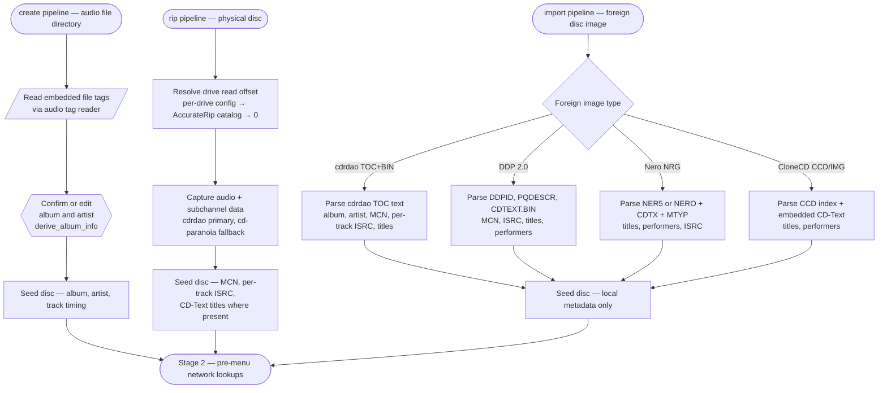
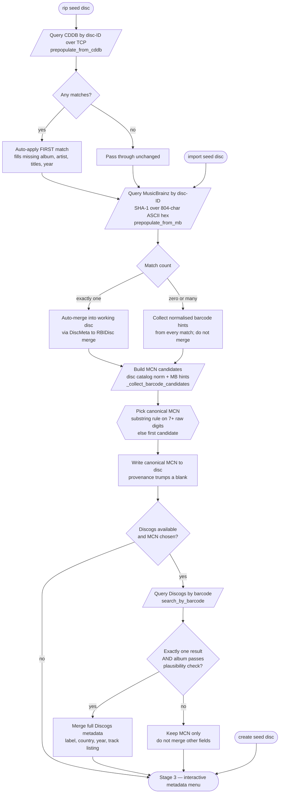
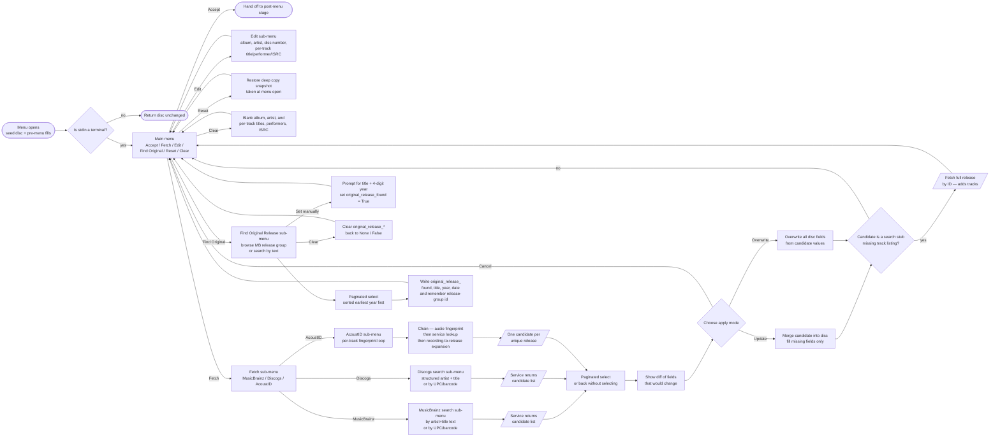
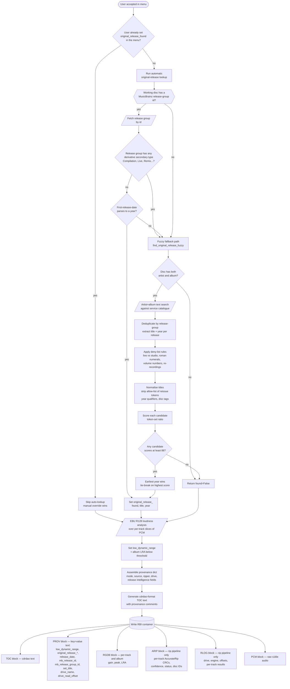

# Metadata Pipeline Overview

> **Purpose**: Cross-cutting view of how album, artist, track, and release-intelligence metadata are sourced, merged, and ultimately written into an RBI container — across the create, rip, and import pipelines.

## Audience

This document is for engineers porting the metadata pipeline to another language, or onboarding to the project. It deliberately collapses module-internal detail and surfaces the orchestration: **which services are queried, in which order, at which pipeline stage, gated by which conditions, and how the result lands on disk**.

For per-module detail (data shapes, error paths, individual algorithms), see the corresponding `docs/flow/<module>.md` documents once they exist; for now, the inline file:line citations are the navigation aid.

## Overview

`cdda2img` has three pipelines that build an RBI container: **create** (audio files), **rip** (physical disc), and **import** (foreign disc image). All three converge on the same logical disc representation and the same interactive confirmation step, but they differ in:

- which local-source metadata extraction they run first;
- which network services they pre-populate from before the menu opens;
- whether they have AccurateRip / rip-log artefacts to record alongside the metadata.

The metadata pipeline is itself layered:

1. **Local-source extraction** (no network) — embedded file tags, or the metadata regions of a foreign disc image (cdrdao TOC text, DDP DDPID/PQDESCR/CDTEXT.BIN, NRG CDTX, CCD index + CD-Text). Produces a seed disc with whatever the source itself carries.
2. **Pre-menu network lookups** (automatic) — fired *before* the interactive menu opens. Each has its own auto-apply gate; some are silently skipped on multiple matches, some auto-apply the first match unconditionally.
3. **Menu-driven network lookups** (interactive) — the user presses keys in the metadata menu to trigger a MusicBrainz text search, a Discogs search, an AcoustID per-track fingerprint, or to open the original-release finder. Each result is shown with a diff and confirmed (update missing fields, or overwrite all).
4. **Post-menu enrichment** — once the user accepts, the original-release lookup runs (unless the user already set it manually inside the menu). EBU R128 loudness analysis runs and sets the low-dynamic-range flag.
5. **Container write** — the accumulated disc is serialised into the RBI container blocks: TOC (cdrdao text), PROV (release intelligence as key/value text), RGDB (per-track loudness), ARIP (AccurateRip results, rip pipeline only), RLOG (structured rip log, rip pipeline only).

## Merge confluence: `_merge_into_disc`

The DiscMeta-to-RBIDisc merge is the confluence point. The actual merge step is `mb_lookup._merge_into_disc(meta, disc) -> RBIDisc` (and its sibling `_overwrite_disc` for the menu's "Overwrite All" mode), which goes directly from a remote result (DiscMeta) into the working disc record (RBIDisc). See `mb_lookup.py:_merge_into_disc` (single-match path, R1 disambiguation path, R4 ISRC tally path) and `_overwrite_disc` (menu override path).

## Invariants and Constraints

These rules are not visible in the flowcharts; they govern which arrows are followed. A reimplementation that ignores any of these will produce subtly wrong metadata.

### Auto-apply gates (pre-menu)

- **CDDB pre-population auto-applies the first match unconditionally.** Server returns multiple matches → first one wins, by server ordering. The user is not asked.
- **MusicBrainz disc-ID pre-population auto-applies only when there is exactly one match.** Zero or multiple matches → the disc is returned unchanged, but normalised 13-digit barcode hints from every returned match are still collected and forwarded to the Discogs step.
- **Discogs barcode pre-population auto-merges only when both** (a) exactly one search result returns, **and** (b) the result's album passes a substring/separator-asymmetry plausibility check against the working disc's album. Anything else → the canonical MCN is still written to the disc (because a populated MCN is more useful than a blank one, and the menu's edit flow can correct a wrong guess), but no other fields are merged.

### Canonical MCN selection rule

- Candidates are assembled from the normalised disc catalog (when it already normalises to 13 digits) plus any barcode hints from MusicBrainz, de-duplicated in order.
- Selection is **deductive**: if the disc's raw catalog string contains 7 or more raw digits that appear as a substring of any candidate, that candidate wins. The reasoning is that printed barcodes are typically GTIN-12 without the check digit, which is a substring of GTIN-13 — substring bridges all three.
- Otherwise the first candidate wins (best guess fallback). The menu's edit flow lets the user override.

### Manual-override gate on original release

- `populate_original_release` returns immediately when `original_release_found` is already True. The user can set this manually inside the metadata menu's "Find Original Release" sub-menu; the automatic post-menu lookup must not overwrite that.

### Original-release derivative rejection

- A MusicBrainz release group whose secondary types include any of: Compilation, Live, Remix, DJ-mix, Mixtape/Street, Demo, Interview, Audiobook, Audio drama, Spokenword — is **rejected** as an "original release" candidate. Its first-release-date is the date of the derivative work, not of the underlying album. When the primary release-group path rejects on this rule, the fuzzy fallback runs instead.

### Fuzzy fallback acceptance rule

- Title normalisation strips a research-derived allow-list of reissue tokens (Remastered, Deluxe, Anniversary, etc., longest-first to avoid collisions).
- Deny-list rules reject pairs differing in: live/studio markers, roman-numeral suffixes (asymmetric or differing), arabic-numeral suffixes (differing), volume/part numbers (differing), or any "re-recording" marker on either side.
- Scoring uses a token-set ratio fuzzy match against a fixed threshold of 88. Among candidates passing the threshold, **earliest year wins**; tie-broken by highest score.

### MusicBrainz disc-ID computation

- The disc ID is the URL-safe base64 of SHA-1 over an **804-character ASCII uppercase-hex string**, not the raw binary integers. A reimplementation that hashes raw bytes will produce a valid-looking but wrong ID that the service silently rejects.

### Interactive-step ordering

- In the create pipeline, **`derive_album_info` opens its own interactive accept/edit prompt** for album title and album artist, *before* the metadata menu opens. There are two distinct interactive stages, not one.
- In the rip and import pipelines, there is no `derive_album_info` step; the seed metadata comes from the local source (CD-Text, DDP descriptors, or whatever the rip path captured) and from CDDB/MusicBrainz pre-population, and the metadata menu is the only interactive step.

### Loudness must precede provenance assembly

- EBU R128 loudness analysis writes `low_dynamic_range` onto the disc; the provenance dict is assembled from the disc after loudness has run. Reordering these two steps will leave `low_dynamic_range` out of the PROV block.

### TTY gating

- The metadata menu returns the disc unchanged when standard input is not a terminal.
- The interactive AccurateRip drive-offset confirmation prompt is skipped when not a terminal.
- The auto-create-config-from-example prompt is also TTY-gated.

## Data Shapes

| Direction | Shape | Notes |
|-----------|-------|-------|
| Local source → seed disc | A full disc record with timing populated and whatever titles/ISRC/MCN the source could extract | Source-specific extractors all produce the same disc structure; downstream code is source-agnostic |
| Remote service → candidate | One or more candidate disc descriptions, each a flat record of optional fields (album, artist, catalog/MCN, MusicBrainz release id, MusicBrainz release-group id, Discogs release id, release date, original release date, country, label, label catalogue number, disc number, disc total, set title, source-tag) plus an optional per-track list | Sources are tagged with the originating service so downstream logic can prefer or reject by provenance |
| Candidate → working disc | A merge step that takes one candidate and one working disc, returns a new working disc with either (update) missing fields filled in from the candidate, or (overwrite) all candidate fields replacing existing values | The two merge modes are user-selected in the confirmation step |
| Final disc + extras → container | One disc record + optional packed loudness block + optional AccurateRip block + optional rip-log block + a key/value provenance dict | Container writer serialises into TOC, PROV, RGDB, ARIP, RLOG, PCM blocks in that order |

## Stage 1 — Pipeline Entry and Local-Source Extraction

The three pipelines diverge on which local source they extract from, then converge on the same metadata orchestration.

### Step Descriptions

1. **Create pipeline entry**: A directory of audio files is the input. No physical disc, no foreign image.
2. **Read embedded file tags**: The first readable file is scanned for an album-artist tag (a fixed priority list of tag names) and an album tag. The parent directory name is the fallback for the album.
3. **Confirm or edit album and artist**: An interactive accept/edit prompt opens for the album title and album artist. This is a separate interactive step that runs *before* the main metadata menu opens later in the pipeline. See `metadata.py:_confirm`.
4. **Create seed disc**: The seed disc carries the confirmed album and artist plus per-track timing derived from the transcoded WAV durations. Track titles are blank at this point.
5. **Rip pipeline entry**: A physical optical drive is the input.
6. **Resolve drive read offset**: A three-tier lookup determines the read offset to apply. User-confirmed per-drive config entries always win; otherwise the AccurateRip catalog is consulted (auto-apply at three or more submissions; interactive prompt at lower confidence on a terminal); otherwise zero with a warning. See `cdda2img.py:_resolve_drive_offsets`.
7. **Capture audio and subchannel data**: cdrdao is the primary ripper (captures MCN, per-track ISRC, and CD-Text from the subchannels); cd-paranoia is the fallback (no subchannel data). The returned disc has track timing and whatever subchannel metadata could be read.
8. **Create rip seed disc**: Whatever MCN, ISRC, and CD-Text titles came back from the subchannel scan are present on the seed. Album and artist may be blank.
9. **Import pipeline entry**: A foreign disc image path is the input. The suffix or directory shape selects the parser.
10. **Branch on foreign image type**: A four-way branch over file extension and directory shape.
11. **Parse cdrdao TOC+BIN**: The text TOC is parsed by the shared TOC parser; titles, performer, MCN, and ISRC come from the TOC text. See `cdrdao_reader.py:parsed_to_rbi_disc`.
12. **Parse DDP 2.0**: DDPID supplies the MCN; PQDESCR supplies per-track timing and ISRC; CDTEXT.BIN supplies titles and performers. See `ddp_reader.py:_parse_ddp`.
13. **Parse Nero NRG**: NER5 (64-bit offsets) or NERO (32-bit) DAOX/DAOI blocks supply timing; CDTX supplies CD-Text; MTYP is consulted. See `nrg_reader.py:_parse_nrg`.
14. **Parse CloneCD CCD/IMG**: The text index supplies timing; embedded CD-Text packs (if present) supply titles and performers. See `ccd_reader.py:_parse_ccd_image`.
15. **Create import seed disc**: All four parsers produce the same disc shape. Downstream stages are source-agnostic.
16. **Hand off to the network stage**: All three pipelines now hold a seed disc with track timing. What's missing — album, artist, titles, release year, label, country — is filled in by Stage 2 and the metadata menu.

## Stage 2 — Pre-Menu Network Lookups (automatic, gated)

These lookups fire before the metadata menu opens. The create pipeline has none; the import pipeline runs MusicBrainz then Discogs; the rip pipeline runs CDDB first, then MusicBrainz then Discogs (the shared finalise step).

### Step Descriptions

1. **Query CDDB**: Rip pipeline only. A TCP session computes the CDDB disc ID from the rip's track LSNs and lead-out LSN, then queries the configured server. See `cddb.py:prepopulate_from_cddb`. Called only from `rip_image` in `cdda2img.py:1293`.
2. **Branch on CDDB matches**: Zero matches → pass through. Any matches → take the first.
3. **Auto-apply first CDDB match**: Per the CDDB protocol, the server returns matches in best-first order. The implementation takes the first match without consulting the user, even when multiple are returned. Missing album, artist, release year, and per-track titles are filled in.
4. **Query MusicBrainz by disc ID**: Shared rip and import finalise step. The disc ID is computed in pure code by hashing the 804-character ASCII uppercase-hex representation of the TOC, then URL-safe base64 encoding. See `mb_lookup.py:prepopulate_from_mb`.
5. **Branch on MusicBrainz match count**: Exactly one → auto-merge. Zero or multiple → no merge.
6. **Auto-merge MusicBrainz result**: The candidate is merged into the working disc; existing non-blank fields are preserved.
7. **Collect barcode hints**: Even when no merge happens, every match's normalised 13-digit barcode is collected. These hints feed the Discogs step when the disc has no embedded MCN.
8. **Build MCN candidate list**: The disc's existing catalog (if it normalises to 13 digits) plus the de-duplicated barcode hints from MusicBrainz, in order. See `cdda2img.py:_collect_barcode_candidates`.
9. **Pick canonical MCN**: The deductive rule (7+ raw digits as substring of a candidate) runs first; otherwise the first candidate wins. See `cdda2img.py:_pick_canonical_mcn`.
10. **Write canonical MCN**: The chosen MCN is written to the disc even when the rest of the Discogs step bails out, because a populated MCN is more useful than a blank one and the menu's edit flow can correct it.
11. **Check Discogs availability and MCN**: The Discogs step bails out when no MCN was chosen or when the Discogs library/token is not configured.
12. **Query Discogs by barcode**: See `discogs_lookup.py:search_by_barcode`.
13. **Branch on Discogs result count and plausibility**: Exactly one result AND its album passes the substring/separator-asymmetry guard against the working disc's album.
14. **Merge Discogs metadata**: Label, country, year, and track listing are merged in.
15. **Keep MCN only**: The merge is skipped, but the MCN already written in step 10 remains.
16. **Hand off to the menu**: All three pipelines now have whatever the local sources and the auto-apply network lookups could produce.

## Stage 3 — Interactive Metadata Menu

The menu is the convergence point of every pipeline. It opens after Stage 2 and lets the user accept, edit, fetch more metadata, or reset.

### Step Descriptions

1. **Menu opens**: A deep-copy snapshot of the disc is taken for the Reset option. Seed artist and seed title strings are remembered as immutable search anchors. See `metadata_menu.py:run_metadata_menu`.
2. **TTY gate**: When standard input is not a terminal (batch mode), the menu returns the disc unchanged. The rest of the pipeline still runs.
3. **Main menu**: Six commands — Accept, Fetch, Edit, Find Original Release, Reset, Clear.
4. **Accept**: Returns the disc to the post-menu stage.
5. **Edit**: Direct edits to album, artist, disc number, and per-track title/performer/ISRC. No network. See `metadata_menu.py:_edit_menu`.
6. **Reset**: Restores the deep-copy snapshot taken when the menu opened. Also clears the remembered MusicBrainz release-group id.
7. **Clear**: Blanks album, artist, and every per-track title/performer/ISRC, preserving timing.
8. **Fetch sub-menu**: Three remote sources — MusicBrainz, Discogs, AcoustID.
9. **MusicBrainz search sub-menu**: Either an artist+title text search (built into a field-qualified Lucene query) or a UPC/barcode search.
10. **Discogs search sub-menu**: Either a structured artist+title search (more precise than a free-text query) or a UPC/barcode search.
11. **AcoustID sub-menu**: Lists tracks; the user picks one (or supplies an external file path). For each chosen track, the create pipeline reuses the per-track WAV; the rip and import pipelines extract a per-track WAV slice from the raw PCM on demand and cache it.
12. **AcoustID chain**: For each chosen track, the audio fingerprint is extracted by an external fingerprint tool, sent to the AcoustID service for recording matches, and each recording is then expanded to one candidate per unique release via a service follow-up call. Single-track candidates are tagged with the user-supplied track number so the merge targets the right track. See `acoustid_lookup.py:fingerprint_and_lookup`.
13. **Paginated select**: Ten results per page; user navigates and picks a candidate, or backs out.
14. **Show diff**: Each field that would change is printed with old and new values. New ISRC values for previously blank fields are shown explicitly.
15. **Choose apply mode**: Update (fill missing fields only) or Overwrite (replace existing). This is the user-facing confluence point. See `metadata_menu.py:_confirm_apply`.
16. **Merge candidate into disc — update**: Existing non-blank fields are preserved; only missing ones are filled. See `mb_lookup.py:_merge_into_disc`.
17. **Overwrite candidate into disc**: Candidate fields replace existing ones where the candidate has a value. See `mb_lookup.py:_overwrite_disc`.
18. **Candidate-is-a-stub check**: Search-result objects often carry no track listing. When the candidate carries a service release id but no tracks, a second call fetches the full release (with tracklist) and that fuller candidate is used for the merge.
19. **Find Original Release sub-menu**: Manual entry, MusicBrainz search, or clear. Search uses the remembered release-group id (if any) to enumerate the group; otherwise it does an artist+title text search.
20. **Original release — paginated select**: Results sorted oldest-first.
21. **Apply original release**: The four fields original_release_found, original_release_title, original_release_year, original_release_date are populated from the chosen release. The MusicBrainz release-group id of the chosen release is remembered for subsequent sub-menu use.
22. **Set original manually**: The user types a title and 4-digit year; original_release_found is set to True. This blocks the post-menu auto-population.
23. **Clear original**: Resets the four original-release fields to None/False. The post-menu auto-population will then run as normal.

## Stage 4 — Post-Menu Enrichment and Container Write

After the user accepts in the metadata menu, two automatic steps run, then the container is written.

### Step Descriptions

1. **User accepted in menu**: Control returns to the shared finalise function (rip and import) or the create pipeline tail.
2. **Manual override gate**: If the user already set the original release manually inside the menu, the automatic lookup is skipped entirely. See `original_release.py:populate_original_release`.
3. **Run automatic original-release lookup**: Two-path dispatch.
4. **Primary path — release-group id check**: Only runs when the working disc has a MusicBrainz release-group id (set by an earlier merge from disc-ID prepop or from a menu-driven MusicBrainz selection).
5. **Fetch release group by id**: A service call retrieves the release-group record.
6. **Reject derivative release groups**: If any of Compilation, Live, Remix, DJ-mix, Mixtape/Street, Demo, Interview, Audiobook, Audio drama, Spokenword appears in the secondary-type list, the primary path is abandoned and the fuzzy fallback runs. The first-release-date of a derivative release group is the date of the derivative, not of the underlying album.
7. **Parse first-release-date to a year**: A four-digit year is required. Other formats fall through to the fuzzy path.
8. **Set original release fields**: original_release_found becomes True; title comes from the release-group title (or the disc album as fallback); year is the parsed year.
9. **Fuzzy fallback entry**: Runs when the primary path was skipped or rejected.
10. **Artist and album required**: Both must be non-empty; otherwise return not-found.
11. **Artist + album text search**: A service text-search query is built from the artist and album; up to fifty results are fetched.
12. **Deduplicate and extract**: Results are deduplicated by release-group id; each yields a (title, year) pair using **release-group first-release-date only** (R5: candidates without one are skipped — the per-release-date fallback admitted pre-album promo pressings as "the original").
13. **Apply deny-list rules**: Pairs differing in live vs studio markers, roman-numeral suffixes, volume/part numbers, arabic-numeral suffixes, or with re-recording markers on either side are rejected.
14. **Normalise titles**: Both sides are run through the title normaliser — strips year qualifiers in brackets (e.g. "2011 remaster"), disc-number tags, the longest-first allow-list of reissue tokens, leading "the", and remaining punctuation. The result is the comparable stem.
15. **Score each candidate**: Token-set ratio between the normalised disc title and each normalised candidate title.
16. **Threshold check**: Candidates scoring below 88 are dropped.
17. **Earliest wins**: Among remaining candidates, the earliest year wins; ties broken on highest score. The winning (title, year) becomes the original release.
18. **EBU R128 loudness analysis**: Per-track slices of the PCM are analysed for integrated gain, true peak, and loudness range. The album LRA is compared to a configurable threshold; below threshold sets low_dynamic_range to True, above sets it to False.
19. **Assemble provenance dict**: A flat dict of pipeline-specific keys (mode = create/rip/import, source, ripper, drive name, drive read offset) plus release-intelligence fields written from the disc (low_dynamic_range, original_release_*, release_date, mb_release_id, mb_release_group_id, set_title). See `cdda2img.py:_add_release_provenance`.
20. **Generate cdrdao-format TOC text**: The disc structure is rendered to cdrdao TOC text, with provenance lines as comments.
21. **Write RBI container**: All blocks are written in order — TOC, PROV, RGDB, ARIP, RLOG, PCM — followed by the block directory. See `container.py:build_container`.
22. **TOC block**: cdrdao TOC text.
23. **PROV block**: UTF-8 key=value lines. Always carries creator and created (UTC ISO timestamp); the rest depends on which pipeline ran and which release-intelligence fields are populated.
24. **RGDB block**: Per-track and album EBU R128 gain, peak, and LRA as float32. Present only when loudness analysis ran.
25. **ARIP block**: Per-track AccurateRip v1 and v2 CRCs, confidences, status, plus the two disc IDs and the CDDB id. Present only in the rip pipeline.
26. **RLOG block**: Structured rip log with drive, engine, offsets, and per-track results. Present only in the rip pipeline.
27. **PCM block**: Raw s16le audio, no WAV header (PCM parameters are in the fixed file header).

## Error Handling

| Failure | Trigger | Response | Caller receives |
|---------|---------|----------|-----------------|
| CDDB network error or no match | Socket error, unexpected greeting, or 202 response | Silent; logged at WARNING for network errors only | Disc returned unchanged from `prepopulate_from_cddb` |
| MusicBrainz disc-ID lookup error | Service ResponseError or NetworkError | Silent; logged at DEBUG | Disc returned unchanged with zero barcode hints, match_count=0 |
| MusicBrainz disc-ID returns multiple matches | More than one match | No merge; barcode hints from every match still collected | Disc returned unchanged; barcode hints forwarded to Discogs step |
| Discogs token missing or library missing | Environment variable not set or import fails | `is_available()` returns False; all functions return empty lists | Discogs step bails out; canonical MCN (if chosen) still written |
| Discogs returns zero or many results, or album fails plausibility check | Result count not 1, or `_albums_match` returns False | No merge; MCN already written | Pre-menu Discogs step returns disc with MCN populated only |
| AcoustID unavailable (no API key, no client library, no native fingerprint tool) | Any of: ACOUSTID_API_KEY unset, the AcoustID client library is not installed, the native fingerprint binary is missing from PATH | Menu shows unavailability reason and returns | Disc unchanged |
| AcoustID returns no confident matches | All scores below threshold, or no matches at all | "No confident matches found." printed | Disc unchanged from that sub-menu pass |
| Original-release primary path rejects (derivative or no year) | Secondary-type intersection non-empty, or first-release-date missing/unparseable | Falls through to fuzzy fallback | Whatever fuzzy returns, or found=False |
| Original-release fuzzy returns no candidate above threshold | No score reaches 88, or deny-list rejects all | Return found=False | Fields remain None/False on the disc |
| Metadata menu opened on non-TTY stdin | `sys.stdin.isatty()` returns False | Menu returns immediately | Disc unchanged; downstream pipeline continues |
| Foreign image parse error (any of TOC/DDP/NRG/CCD) | Missing required block, malformed magic, file not found | Exception raised (FileNotFoundError or ValueError) | Caller's try/finally cleans temp files; main handler prints error and exits non-zero |
| MusicBrainz disc-ID computation on a disc with no tracks | `disc.tracks` is empty | Return None | Lookup short-circuits; no service call made |

## Algorithm Notes

### Canonical MCN selection

- **Objective**: Pick the most authoritative 13-digit MCN candidate for the working disc.
- **Inputs**: The working disc's existing catalog string, plus a de-duplicated list of normalised barcode hints from every match returned by the MusicBrainz disc-ID lookup.
- **Decision**: Substring match wins when at least seven raw digits from the disc's catalog appear as a substring of any candidate (printed barcodes are GTIN-12 without check digit, which is a substring of GTIN-13). Otherwise the first candidate wins (best-guess fallback). Blank is worse than a wrong guess the user can correct via the menu.
- **Threshold**: The seven-digit floor is chosen to avoid false positives across unrelated hints.

### Original-release primary path

- **Objective**: Find the earliest known release of the same logical album, given a MusicBrainz release-group id.
- **Decision**: Reject derivative release groups by secondary-type intersection; accept the release group's first-release-date when it parses to a four-digit year.
- **Rejection set**: Compilation, Live, Remix, DJ-mix, Mixtape/Street, Demo, Interview, Audiobook, Audio drama, Spokenword.

### Original-release fuzzy fallback

- **Objective**: Same as primary, but for discs where the working disc has no release-group id (e.g. a disc not in the MusicBrainz disc-ID database).
- **Inputs**: Artist and album from the working disc.
- **Candidate generation**: An artist+album text search against the MusicBrainz service, fetching up to fifty releases, deduplicated by release-group id. Each release contributes a (title, year) pair using **release-group first-release-date only** (R5: candidates without one are skipped).
- **Filtering**: Deny-list rules reject pairs differing in live/studio markers, roman-numeral suffixes, arabic-numeral suffixes, volume/part numbers, or with a re-recording marker on either side.
- **Title normalisation**: Strip year qualifiers in brackets, disc-number tags, a longest-first allow-list of reissue tokens (Super Deluxe Edition, Super Deluxe, Deluxe Edition, Deluxe, Expanded Edition, ..., Mobile Fidelity, ...) — longest-first to avoid partial matches eating shorter tokens. Strip leading "the". Strip remaining punctuation.
- **Scoring**: Token-set ratio fuzzy match between the disc's normalised title and each candidate's normalised title.
- **Acceptance**: Score at least 88. Among accepted candidates, earliest year wins; tie-broken on highest score.
- **Note**: Threshold and algorithm choices are documented in the project's private research file.

### MusicBrainz disc-ID computation

- **Objective**: Compute a service-compatible disc identifier from the TOC.
- **Input layout**: First track number as 2-character uppercase hex, last track number as 2-character uppercase hex, lead-out absolute LBA as 8-character uppercase hex (zero-padded), then ninety-nine 8-character uppercase hex absolute LBAs (one per track, zeroed for unused slots).
- **Hash**: SHA-1 over the concatenated 804-character ASCII text. Not over raw binary integers — that produces a valid-looking but wrong identifier.
- **Encoding**: URL-safe base64 (`+` becomes `.`, `/` becomes `_`, `=` becomes `-`).
- **Track offset**: For each track in the working disc, the absolute LBA used is start_frame + pregap_frames + 150 (the standard 2-second lead-in).
- **Lead-out**: Total disc frames + 150.

### AccurateRip-style barcode normalisation

- **Objective**: Reduce any raw barcode (UPC-A 12, EAN-13, hyphenated, with leading zeros stripped) to a canonical 13-digit GTIN-13 string.
- **Procedure**: Strip everything that is not a digit. If the result is exactly 12 digits, prepend a zero (GTIN-12 to GTIN-13). Accept only when the final length is exactly 13.
- **Rejection**: Anything else (too short, too long, non-numeric after stripping) returns None.

## Platform and Hardware Notes

| Dependency | Assumed platform | Portability note |
|------------|-----------------|------------------|
| External audio fingerprint tool on PATH | Linux/macOS/Windows; needs separate install (libchromaprint and the fpcalc tool) | A reimplementation that bundles its own fingerprint extractor avoids the install-dependency check entirely |
| Environment variable for AcoustID API key (`ACOUSTID_API_KEY`) | Any POSIX-style environment | Portable; consider also reading from the project's TOML config |
| Environment variable for Discogs token (`DISCOGS_TOKEN`) | Any POSIX-style environment | Portable; consider also reading from the project's TOML config |
| TCP outbound to a CDDB server on port 888 | Any TCP-capable host with outbound network | Server availability is fragile (the public CDDB ecosystem has decayed); a reimplementation should make the server endpoint configurable and tolerate the long-term disappearance of that protocol |
| HTTPS to MusicBrainz, Discogs, AcoustID endpoints | Any TCP/TLS-capable host | Portable; rate limits apply (1 req/sec for MusicBrainz; check Discogs terms) |
| Standard-input TTY detection (`isatty()`) gating interactive prompts | POSIX terminal semantics | Portable across POSIX-like terminals; Windows console behaviour for `isatty()` is equivalent. Headless CI must not trigger interactive prompts |
| XDG-style configuration path for the per-drive TOML config | Linux/macOS | Replace with a platform-appropriate config path on Windows; the same TOML schema applies |

## Connects To

- **`cddb.py`** — TCP CDDB query, called from the rip pipeline only. Produces a disc with album, artist, release year, and per-track titles.
- **`mb_lookup.py`** — MusicBrainz disc-ID lookup (pre-menu), text search (menu), barcode search (menu), release-group lookup (menu and post-menu original-release primary path), single-release lookup (menu, for stub expansion). Provides the `_merge_into_disc` and `_overwrite_disc` functions used everywhere a candidate is applied to a disc.
- **`acoustid_lookup.py`** — Per-track fingerprint and AcoustID query chained to MusicBrainz recording lookup. Menu-driven only; produces one candidate per unique release.
- **`discogs_lookup.py`** — Discogs barcode and structured-search queries. Used both pre-menu (barcode auto-merge with strict plausibility gate) and menu-driven (full search by either MCN or artist+title).
- **`original_release.py`** — Post-menu lookup; primary path queries MusicBrainz release-group, fuzzy fallback queries MusicBrainz text search and scores with a fuzzy string matcher.
- **`metadata.py`** — Local-source tag extraction for the create pipeline. Interactive accept/edit prompt for album and artist.
- **`toc_parser.py`** — Parses cdrdao TOC text; used by both the cdrdao-rip integration and the cdrdao-TOC import path.
- **`cdrdao_reader.py`** — cdrdao TOC+BIN import; consumes `toc_parser` output and produces a seed disc.
- **`ddp_reader.py`** — DDP 2.0 import; parses DDPID, PQDESCR, CDTEXT.BIN. Also exports a CD-Text pack parser used by `nrg_reader` and `ccd_reader`.
- **`nrg_reader.py`** — Nero NRG import; parses NER5/NERO + CDTX + MTYP.
- **`ccd_reader.py`** — CloneCD CCD/IMG import; parses the text index and embedded CD-Text.
- **`lookup_result.py`** — Defines the shared candidate-record structure (DiscMeta + TrackMeta). The actual merge into the working disc is done by `mb_lookup._merge_into_disc` / `_overwrite_disc`.
- **`metadata_menu.py`** — The interactive confirmation menu. Orchestrates MusicBrainz, Discogs, AcoustID, and the Find Original Release sub-menu.
- **`cdda2img.py`** — Pipeline entry points (`create_image`, `rip_image`, `import_image`) and the shared `_finalize_import` post-rip/import step. Holds `_resolve_drive_offsets`, `_collect_barcode_candidates`, `_pick_canonical_mcn`, `_prepopulate_from_discogs`, `_albums_match`, `_add_release_provenance`.
- **`rbi_format.py`** — `RBIDisc` is the target into which every lookup result is eventually merged.
- **`container.py`** — Writes the final RBI file. `build_prov_block` serialises the provenance dict; `build_container` assembles all blocks.
- **`replaygain.py`** — EBU R128 loudness analysis; sets `low_dynamic_range` on the disc before the provenance dict is built.
- **`accuraterip.py`** — Rip-pipeline post-rip checksum verification; produces the ARIP block.
- **`rip_log.py`** — Rip-pipeline structured log; produces the RLOG block.

## File:Line Index

For quick navigation between this document and the source:

- Pipeline entry points: `cdda2img.py:441` (`create_image`), `cdda2img.py:663` (`import_image`), `cdda2img.py:1242` (`rip_image`), `cdda2img.py:944` (`_finalize_import`).
- Drive-offset resolution (rip only): `cdda2img.py:1030` (`_resolve_drive_offsets`).
- CDDB pre-population: `cddb.py:236` (`prepopulate_from_cddb`); called from `cdda2img.py:1294`.
- MusicBrainz pre-population: `mb_lookup.py:575` (`prepopulate_from_mb`); auto-fill gate at `mb_lookup.py:596`.
- Discogs pre-population: `cdda2img.py:844` (`_prepopulate_from_discogs`); MCN candidate build at `cdda2img.py:768`; canonical pick at `cdda2img.py:795`; album plausibility at `cdda2img.py:820`.
- Metadata menu entry: `metadata_menu.py:950` (`run_metadata_menu`); fetch sub-menu at `metadata_menu.py:662`.
- Menu-driven applies (the confluence): `mb_lookup.py:452` (`_merge_into_disc`), `mb_lookup.py:514` (`_overwrite_disc`); confirm-apply diff at `metadata_menu.py:247`.
- Original release post-menu: `original_release.py:137` (`populate_original_release`); manual-override gate at `original_release.py:143`; primary path at `original_release.py:82`; fuzzy fallback at `original_release.py:402`.
- Loudness sets `low_dynamic_range`: `cdda2img.py:911` (`_measure_loudness_phase`); create-pipeline equivalent at `cdda2img.py:514`.
- Provenance assembly: `cdda2img.py:371` (`_add_release_provenance`); called at `cdda2img.py:533` (create) and `cdda2img.py:999` (shared finalise).
- Container write: `container.py:141` (`build_container`); PROV block at `container.py:122` (`build_prov_block`).
- Disc-ID computation: `mb_lookup.py:65` (`compute_disc_id`), `cddb.py:40` (`compute_cddb_disc_id`).
