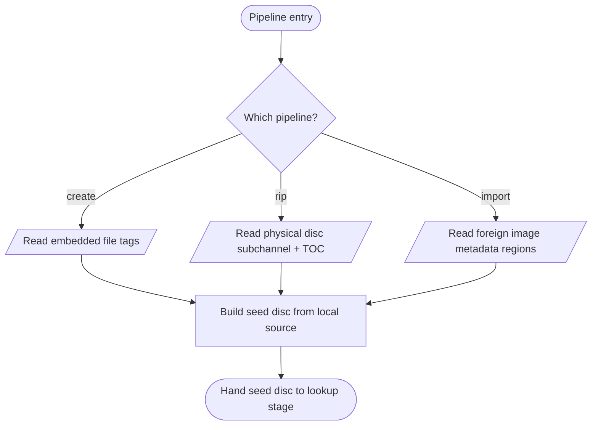
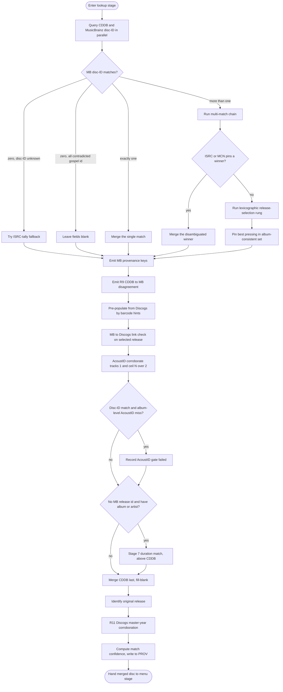
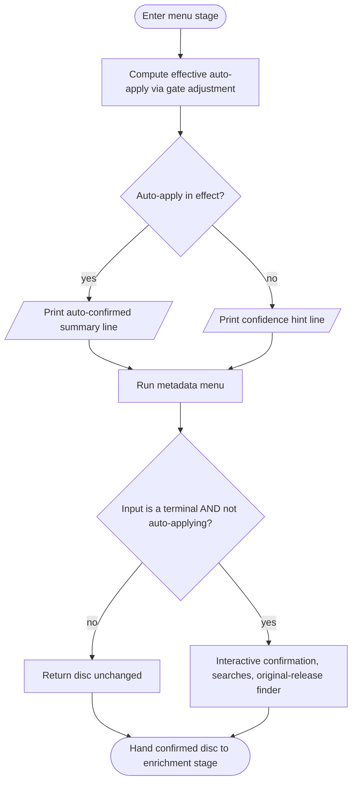
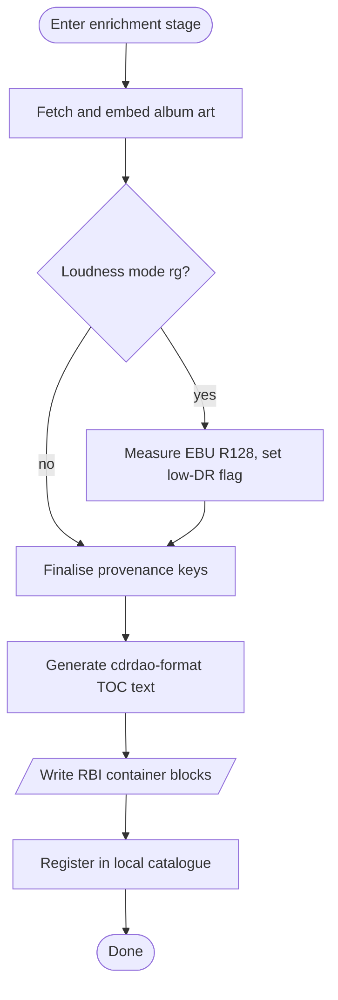

# Metadata Pipeline Overview

> **Purpose**: Cross-cutting view of how album, artist, track, and release-intelligence metadata are sourced, merged, scored, and ultimately written into an RBI container — across the create, rip, and import pipelines.

## Audience

This document is for engineers porting the metadata pipeline to another language, or onboarding to the project. It deliberately collapses module-internal detail and surfaces the orchestration: **which services are queried, in which order, at which pipeline stage, gated by which conditions, and how the result lands on disk**.

PROV key names (e.g. `release_selected_via`, `acoustid_gate`) and `file:line` citations are retained throughout as navigation aids. PROV keys are part of the on-disk RBI format contract (like RBI header field names), not internal implementation detail.

## Overview

`cdda2img` has three pipelines that build an RBI container: **create** (audio files), **rip** (physical disc), and **import** (foreign disc image). All three converge on the same logical disc representation and the same interactive confirmation step, but they differ in:

- which local-source metadata extraction they run first;
- which network services they pre-populate from before the menu opens;
- whether they have AccurateRip / rip-log artefacts to record alongside the metadata.

**Menu policy (current — user decision 2026-06-20).** The interactive metadata menu opens on **every** rip / import / create run, *unless* the caller passes `--auto` (or the config sets `auto = true`), *and* standard input is a terminal. A match-confidence score (STRONG / MEDIUM / LOW / NONE) is computed and displayed as a hint, but it is **display-only**: it never skips the menu on its own. The effective auto-skip decision is `auto_apply = _gate_adjusted_auto(auto, provenance)`, which equals `auto` except that a failed §10.4 AcoustID gate forces it to False. The interactive menu controller then short-circuits when `not stdin.isatty() or auto_apply` (`menu_state.py:1023`).

The metadata pipeline is layered:

1. **Local-source extraction** (no network) — embedded file tags (create), or the metadata regions of a foreign disc image (cdrdao TOC text, DDP DDPID/PQDESCR/CDTEXT.BIN, NRG CDTX, CCD index + CD-Text). Produces a seed disc with whatever the source itself carries.
2. **Pre-menu network lookups** (automatic) — fired *before* the interactive menu opens. The rip and import pipelines query CDDB, MusicBrainz, Discogs, and AcoustID. The create pipeline queries AcoustID only (CDDB, MusicBrainz, and Discogs are disabled because no disc fingerprint is available).
3. **Pre-menu original-release lookup, corroboration, and confidence scoring** — original-release identification runs before the menu in all three pipelines so the menu can display it in the initial summary. Discogs master-year corroboration (R11) and match-confidence computation also run before the menu. The confidence score is displayed; it does not gate the menu.
4. **Menu-driven interaction** (interactive on a TTY, unless auto-apply is in effect) — the user presses keys in the metadata menu to trigger a MusicBrainz text search, a Discogs search, an AcoustID per-track fingerprint, or to open the original-release finder. Each result is shown with a diff and confirmed (update missing fields, or overwrite all).
5. **Post-menu enrichment** — album art is fetched and embedded; EBU R128 loudness analysis runs and sets the low-dynamic-range flag.
6. **Container write** — the accumulated disc is serialised into RBI blocks: TOC (cdrdao text), PROV (release intelligence as key/value text), RGDB (per-track loudness), ARIP (AccurateRip results, rip pipeline only), RLOG (structured rip log, rip pipeline only).

## Precedence

The single ordering rule governing every automatic merge is **fill-blank in precedence order**:

> **disc-baked CD-Text  >  MusicBrainz  >  Discogs  >  AcoustID  >  CDDB**

Every automatic merge is fill-blank: an existing non-blank field wins, so a source can only supply fields nothing higher-precedence already filled. CDDB is applied **dead last**, making it a zero-trust last-resort gap-filler (`_run_metadata_lookups`, `cdda2img.py:1583`). CDDB's flat freedb `TTITLE` ("Artist / Title" in one string) cannot cleanly split title from performer the way MusicBrainz's distinct fields can, so it is no longer allowed to win a contested field. The CDDB *query* still runs in parallel with the MusicBrainz lookup so a slow or failing server never gates the rip.

## Merge confluence: `_merge_into_disc`

The result-to-disc merge is the confluence point. `mb_lookup._merge_into_disc(meta, disc) -> RBIDisc` goes from a remote result (a `DiscMeta`) into the working disc record (an `RBIDisc`), field by field, fill-blank. Its sibling `_overwrite_disc` is the menu's "Overwrite All" mode. Every automatic source — MusicBrainz single-match, the multi-match rung, the R4 ISRC tally, the duration matcher, and CDDB — folds in through `_merge_into_disc`.

A pressing-level rule applies at the merge: a release id that came from a *recording* fingerprint (AcoustID) or a *text+duration* fuzzy match is **stripped to None before merging** — those paths identify a recording or an album, never a specific pressing, so they must not bake a pressing-level release id into the disc. Only the disc-ID single-match path and the multi-match rung (both of which share the disc-ID fingerprint) are allowed to keep the release id.

## Invariants and Constraints

These rules are not visible in the flowcharts; they govern which arrows are followed. A reimplementation that ignores any of these will produce subtly wrong metadata.

### Menu / auto-apply

- **The interactive menu opens on every run unless `--auto` (or config `auto = true`) is set.** The match-confidence recommendation is **display-only** and never skips the menu by itself. There is no "STRONG → menu skipped" behaviour.
- **The effective skip decision is `auto_apply = _gate_adjusted_auto(auto, provenance)`** (`cdda2img.py:1391`). This returns `auto` unchanged, *except* that when PROV carries `acoustid_gate=failed` it prints a warning and returns False — the §10.4 gate suppresses auto-commit (warn-only; the disc-ID result is kept and flagged, never reverted).
- **The menu controller itself short-circuits when `not stdin.isatty() or auto_apply`** (`menu_state.py:1023`). A non-TTY (scripted) run therefore behaves like auto-apply regardless of the flag.

### MusicBrainz disc-ID resolution

- **A disc-ID lookup is filtered by an on-disc consistency gate (Unit G) first.** Any candidate whose barcode/ISRC contradicts a non-blank on-disc MCN or per-track ISRC is dropped before any resolution runs (`prepopulate_from_mb`, `mb_lookup.py:1344`). The count of dropped candidates is recorded as PROV `mb_rejected_inconsistent`.
- **Zero surviving candidates because the disc-ID is unknown to MB** → fall back to the R4 ISRC-tally resolver (`_resolve_via_isrc_tally`), which requires ≥ ceil(N/2) per-track ISRC convergence and itself re-checks on-disc consistency. The tally winner's release id is stripped (recording-level, not pressing-level).
- **Zero surviving candidates because every candidate contradicted a gospel on-disc id** → leave the fields blank for AcoustID / the manual menu; do **not** fall through to the R4 tally (the disc-ID lookup already spoke).
- **Exactly one surviving candidate** → merge it (fill-blank). Confidence later awards `mb_disc_id` (+0.50).
- **More than one surviving candidate** → the multi-match resolution chain runs (below). The disc-ID multi-match always pins a single pressing now; it never abstains.

### Multi-match resolution chain (`_prepop_multimatch`, `mb_lookup.py:1227`)

The chain is: ISRC disambiguation → lexicographic release-selection rung. (The on-disc MCN is **not** a disambiguator — §1a, archival only.)

1. **ISRC disambiguation (R1)** — `_disambiguate_by_isrcs` scores each candidate by agreement with the disc's per-track ISRCs; a unique winner with score ≥ `_MIN_ISRC_AGREE` (= 2) and strict uniqueness wins. Sets PROV `multi_match_isrc_disambiguated=YES` (later: confidence +0.15).
2. **Lexicographic release-selection rung** — when ISRC does not pin a winner, the rung **always pins one pressing** from the album-consistent set. There is no abstain / "commit only agreed facts" / "claim no pressing" path; the previous agreed-facts behaviour has been removed.

   The rung narrows the candidate set to the **plurality release-group** (the album the disc-ID most agrees on). The on-disc MCN plays no part (§1a — it is archival, never a disambiguator); TOC-collision-safe scoping rests on the candidates' own service barcodes via the plurality key. It then ranks the survivors by a pure lexicographic key chain (`_select_release_lexicographic`, `mb_lookup.py:1164`):

   | Key | Name | Type | Rule |
   |-----|------|------|------|
   | 0 | `barcode_plurality` | popularity prior | the most common normalised barcode across the set wins |
   | 1 | `preferred_country` | user preference | rank by position in the `preferred_country` config list (priority, **not** a filter; unlisted = lowest equal) |
   | 2 | `date` | fallback | earliest `release_date` |
   | 3 | `mbid` | terminal | release-id, guarantees a unique deterministic winner |

   No candidate is discarded; the top of the ranking is pinned. Pinning the release id here is legitimate — every survivor shares the disc-ID fingerprint, so this chooses only the *pressing*, never the album. PROV records `release_selected_via` (the key that broke the tie) and, when `preferred_country` fired, `preferred_country_applied`. Later: confidence awards `mb_disc_id_multi` (+0.30), mutually exclusive with `mb_disc_id`.

### Stage-7 duration match (OPT-3)

- **Runs only when no MusicBrainz release id has been set by any higher path** (`disc.mb_release_id is None`) and there is an album or artist to search with (`_run_metadata_lookups`, `cdda2img.py:1716`).
- It text-searches MusicBrainz by album/artist, pre-filters candidates by track count, fetches the survivors, and picks the one whose total duration matches the physical disc (`duration_match_lookup`, `mb_lookup.py:618`).
- **It runs ABOVE CDDB** (OPT-3 reorder): a duration-matched MB release is a stronger guess than CDDB's flat string, so it merges first. PROV records `duration_match_release` (the matched release id, for audit).
- **Its release id is stripped to None before merging** (`replace(dm, mb_release_id=None)`) — a text+duration match identifies an album, not a pressing.
- **OPT-3 tradeoff**: the stage-7 gate needs an album/artist seed already present. A disc whose *only* metadata source is CDDB (no CD-Text, no MB/Discogs/AcoustID hit) never reaches stage-7, because CDDB is merged after it — accepted, to let the duration match outrank CDDB on every other disc.
- **Code↔spec discrepancy (see report)**: because the release id is stripped and the disc had none, `disc.mb_release_id` stays None after this merge. The `mb_duration_match` (+0.20) confidence contributor is gated behind `if disc.mb_release_id:` and is therefore **never reached in practice** — a duration-only match contributes nothing to the score.

### Cross-source corroboration (PROV-only, does not feed selection)

- **§10.3.1 MB→Discogs link check** (`_discogs_barcode_corroborate`, `cdda2img.py:1270`): on the **selected** release only, one MusicBrainz `url-rels` fetch yields both the MB barcode and the linked Discogs release id (from a `…/release/<id>` url-relation target); the Discogs release is then fetched and its barcode compared. Agreement → PROV `discogs_corroborates=YES`; conflict → PROV `discogs_barcode_conflict=mb:<bc>|discogs:<bc>`. Validates the **relation**, not the pressing — an MB editor supplied both the barcode and the link, so the two sides are not independent; disagreement is the useful signal. Does **not** feed selection or confidence. Skips cleanly (no fetch, no PROV key) when there is no selected release, no Discogs token, no Discogs link, or no barcode on either side. Because it keys off `disc.mb_release_id`, it runs for both unique disc-ID hits **and** rung-pinned multi-matches.
- **§10.4 AcoustID gate** (`_acoustid_gate`, `cdda2img.py:1358`): post-selection, set-level. Asks "does the disc audio match the *album* the disc-ID/rung selected?" Matched at the **release-group** level (not release-id — AcoustID is edition-blind), and a single probed track suffices (union membership across all fingerprinted tracks). Fail-only: writes PROV `acoustid_gate=failed` **only** on a genuine album miss and **only** when both sides had release-group evidence to compare (the disc carries a matched release-group AND AcoustID supplied ≥1 release-group). Absence of the key = pass / not-evaluated. On fail, `_gate_adjusted_auto` prints a warning and forces `auto_apply=False`. Because it keys off `disc.mb_release_group_id`, it gates both unique disc-ID hits and rung-pinned multi-matches.
- **R6 AcoustID corroboration** (`_r6_acoustid_corroborate`, `cdda2img.py:1463`): fingerprints tracks 1 and ceil(N/2). When the disc already has an MB release id, the tally only sets PROV `acoustid_corroborates` YES/NO (later: confidence +0.25) and runs the §10.4 gate. When the disc has no release id yet, a consistent winner still sets `acoustid_corroborates=YES`, but its album-level fields are **not** merged (a recording appears on every compilation that includes it — too weak to title a release); CDDB / stage-7 supply the title instead.
- **R11 Discogs master-year corroboration** (`_r11_corroborate_with_discogs_master`, `cdda2img.py:1235`): fires only when MusicBrainz already produced an original-release answer and the disc has a Discogs release id. Agreement → PROV `original_release_corroborated=discogs,mb`; disagreement → PROV `original_release_disagreement=discogs:YYYY|mb:YYYY`, and the disc's `original_release_year` is set to the **earlier** of the two ("prefer the earlier").
- **R9 CDDB↔MB disagreement** (`_emit_r9_disagreement`, `cdda2img.py:1313`): compares the non-MB album/artist view (CDDB if present, else the disc's own embedded values) against the MB candidate via pattern-weighted edit distance after NFC + casefold + reissue-suffix strip; flags fields whose distance exceeds 0.15 in PROV `disagreement_cddb_mb`. Later: confidence penalty −0.10.

### Match-confidence scoring (`build_match_distance`, `match_distance.py:60`)

- Computed in all three pipelines after every lookup signal is baked into PROV. Additive contributors, clamped to [0, 1]; thresholds STRONG ≥ 0.70, MEDIUM ≥ 0.40, LOW ≥ 0.10, NONE < 0.10. **Display-only** — does not gate the menu.
- **Computed TWICE, at two moments, since N6 (2026-08-13) — and the two numbers are allowed to differ.** `build_match_distance` runs *before* the menu and its result is only ever **printed**: it scores the automatic guess, which is what an operator about to review that guess wants on screen. `final_match_distance` runs *after* the menu and is what reaches PROV as `match_confidence` / `match_recommendation`, via the single writer `cdda2img._store_match_distance`. Before N6 these were one call, so every container from the N5 alternatives menu carried `match_confidence=0.550` beside `release_selection=manual` — two keys describing two moments with nothing recording which was which.
- **`release_selection=manual` short-circuits the score to 1.000** (contributor `user_confirmed`), replacing the contributor table rather than adding to it. kgr's ruling: the key says how confident the automatic *guess* is, and a manual selection is not a guess. Consequences: `unique` / `auto_tiebreak` / absent fall through unchanged, and so does **`rejected`** — the user said none of the listed pressings match, but `PressingScreen` keeps the automatic pick and does not clear `mb_release_id`, so a rejected disc scores the same 0.30 as an un-reviewed `auto_tiebreak`. That is a known gap, pinned by `test_rejected_and_auto_tiebreak_are_indistinguishable_by_score`, not a value anyone chose.
- **`mb_duration_match` (+0.20) became reachable with this change.** Stage 7 routes through `strip_pressing_mbid`, which nulls `mb_release_id`, so the guard could never be true at the old pre-menu call site; the menu can set the id, so the post-menu call can reach it.

  | Contributor | Value | Fires when |
  |-------------|-------|-----------|
  | `mb_disc_id` | +0.50 | disc-ID release id set and **not** a rung-pinned multi-match and **not** a duration match |
  | `mb_disc_id_multi` | +0.30 | disc-ID release id set and `release_selected_via` present (rung pinned a multi-match) |
  | `mb_duration_match` | +0.20 | (intended) disc-ID release id set and `duration_match_release` present — **unreachable in practice**: the duration path strips the id, so the release id is never set on this branch (see report) |
  | `acoustid` | +0.25 | PROV `acoustid_corroborates=YES` |
  | `isrc_disambiguated` | +0.15 | PROV `multi_match_isrc_disambiguated=YES` |
  | `cddb_mb_disagreement` | −0.10 | PROV `disagreement_cddb_mb` present |

  `mb_disc_id`, `mb_disc_id_multi`, and `mb_duration_match` are mutually exclusive (the first matching branch wins). In the create pipeline, MB disc-ID / CDDB / Discogs are disabled, so the only reachable positive signal is `acoustid` (+0.25): the score never exceeds 0.25, i.e. at most LOW.

### Validation chokepoints

- **ISRC** values pass through `validators.validate_isrc` at MB ingress and again at every merge site; malformed values are silently dropped (with a WARNING log), never propagated.
- **MCN / barcode** values pass through `barcode.normalize_barcode`, which enforces the GS1 §1.3.1 Modulo-10 check digit; invalid inputs return None and log at DEBUG (silent-drop — routine when scanning third-party metadata).

### Reproducibility / offline

- **R10 offline mode**: `--no-network-services` (and `Config.no_network_services`) short-circuits CDDB, MB, Discogs, AcoustID, and AccurateRip. Combined with the R7 30-day MB disc-ID cache (which caches empty results too), a re-run reproduces a prior rip's metadata without network access.
- **R15 MB rate limit**: pinned to 1 request/second.
- **R10 reproducibility note**: because `preferred_country` shapes the rung's choice, the applied preference is recorded in PROV (`preferred_country_applied`) whenever key 2 fired.

## Data Shapes

| Direction | Shape | Notes |
|-----------|-------|-------|
| Input (create) | A directory of audio files with embedded tags | Album/artist derived from tags; no disc fingerprint exists |
| Input (rip) | A physical disc plus its computed TOC fingerprint and per-track start positions | Enables MB disc-ID, CDDB, and AccurateRip |
| Input (import) | A foreign disc image plus the metadata regions it carries | DDP/NRG/CCD/cdrdao supply MCN, ISRC, CD-Text to varying degrees |
| Internal | A working disc record (album, artist, per-track titles/ISRCs, MCN, release ids, original-release fields) | All sources merge into this fill-blank |
| Internal | A provenance map of key=value strings | Records lookup status, disagreement, corroboration, selection key, confidence |
| Internal | A match-distance record (float score, named contributors, four-level recommendation) | Display-only; written to PROV |
| Output | An RBI container with TOC, PROV, optional RGDB/ARIP/RLOG, and PCM blocks | The disc record is serialised; PCM is verbatim |

## Stage 1 Flowchart — local extraction and seed disc

### Stage 1 Step Descriptions

1. **Pipeline entry**: the chosen subcommand begins.
2. **Which pipeline?**: branch by subcommand — create, rip, or import.
3. **Read embedded file tags**: the create pipeline derives album/artist from the audio files' embedded tags.
4. **Read physical disc subchannel + TOC**: the rip pipeline captures MCN, per-track ISRC, and CD-Text from the disc subchannels and computes the TOC fingerprint.
5. **Read foreign image metadata regions**: the import pipeline parses whatever the foreign format carries (DDP DDPID/PQDESCR/CDTEXT, NRG CDTX, CCD index, cdrdao TOC text).
6. **Build seed disc from local source**: the local-source values become the highest-precedence baseline.
7. **Hand seed disc to lookup stage**: control passes to the network-lookup stage (Stage 2).

## Stage 2 Flowchart — pre-menu lookups, corroboration, scoring

This is the heart of `_finalize_import` → `_run_metadata_lookups` (rip and import), and the inline equivalent in `create_image` (create). The diagram shows the rip/import path; create runs only the AcoustID and original-release nodes.

### Stage 2 Step Descriptions

1. **Enter lookup stage**: `_run_metadata_lookups` begins; the UI shows a status line.
2. **Query CDDB and MusicBrainz disc-ID in parallel**: a thread pool runs the CDDB query and `prepopulate_from_mb` concurrently so a slow/failing CDDB server never gates the rip. CDDB's result is held, not applied yet. (Create runs neither — both are disabled.)
3. **MB disc-ID matches?**: after the Unit-G consistency filter, branch on how many candidates survive.
4. **Try ISRC-tally fallback**: when the disc-ID is unknown to MB, R4 attempts an ISRC-convergence match (≥ ceil(N/2) tracks); the winner's pressing id is stripped before merging.
5. **Leave fields blank**: when MB knew the disc-ID but every candidate contradicted a gospel on-disc id, leave fields for AcoustID / the menu.
6. **Merge the single match**: the lone surviving candidate is merged fill-blank.
7. **Run multi-match chain**: more than one candidate → the disambiguation chain.
8. **ISRC or MCN pins a winner?**: R1 ISRC scoring or MCN-barcode match attempts to pin a single pressing.
9. **Merge the disambiguated winner**: the ISRC/MCN winner is merged; ISRC path also sets `multi_match_isrc_disambiguated`.
10. **Run lexicographic release-selection rung**: no ISRC winner → narrow to the album-consistent plurality release-group and rank by the key chain (barcode_plurality → preferred_country → date → mbid; the on-disc MCN is never a key, §1a).
11. **Pin best pressing in album-consistent set**: the rung pins one pressing, merges it, and records `release_selected_via` (and `preferred_country_applied` if key 2 fired).
12. **Emit MB provenance keys**: write `multi_match_isrc_disambiguated`, `release_selected_via`, `mb_rejected_inconsistent`, and the MB lookup status.
13. **Emit R9 CDDB to MB disagreement**: compare the non-MB view against the MB candidate; flag disagreeing fields.
14. **Pre-populate from Discogs by barcode hints**: search Discogs using the barcode hints collected from every MB match; merge catalogue/label/country fill-blank (or at least write the canonical MCN).
15. **MB→Discogs link check on selected release**: §10.3.1 — follow the MB→Discogs link, compare barcodes (validates the relation, not the pressing), record `discogs_corroborates` / `discogs_barcode_conflict`. PROV-only.
16. **AcoustID corroborate tracks 1 and ceil N over 2**: R6 fingerprints two tracks; sets `acoustid_corroborates` (and, with no prior release id, may set it YES without merging album fields).
17. **Disc-ID match and album-level AcoustID miss?**: the §10.4 gate — only meaningful when both sides have release-group evidence.
18. **Record AcoustID gate failed**: write `acoustid_gate=failed` (later suppresses auto-commit, warn-only).
19. **No MB release id and have album or artist?**: stage-7 gate.
20. **Stage 7 duration match, above CDDB**: text+duration match; records `duration_match_release`; release id stripped before merge.
21. **Merge CDDB last, fill-blank**: the held CDDB result fills only fields nothing richer supplied.
22. **Identify original release**: the original-release lookup runs before the menu (idempotent with any later menu override); reuses the disc-ID prepop meta to save a round-trip.
23. **R11 Discogs master-year corroboration**: cross-check the original-release year against the Discogs master; prefer the earlier on disagreement.
24. **Compute match confidence, write to PROV**: `build_match_distance` produces the score and recommendation; both are written to PROV. Display-only.
25. **Hand merged disc to menu stage**: control passes to Stage 3.

## Stage 3 Flowchart — confidence display, gate, and the menu

### Stage 3 Step Descriptions

1. **Enter menu stage**: control arrives with a fully merged disc and a populated PROV map.
2. **Compute auto_apply via gate-adjusted auto**: `_gate_adjusted_auto(auto, provenance)` — returns `auto`, except that `acoustid_gate=failed` prints a warning and forces False.
3. **auto_apply true?**: choose the message to print (the menu still runs either way; the message differs).
4. **Print auto-confirmed summary line**: a short "Metadata auto-confirmed — 
" line.
5. **Print confidence hint line**: a "Metadata: <recommendation> match, confidence <n> (<signals>)" hint line. The recommendation is shown but does not skip the menu.
6. **Run metadata menu**: `run_metadata_menu` is always called.
7. **stdin is a terminal AND not auto_apply?**: the menu controller's internal short-circuit (`menu_state.py:1023`).
8. **Return disc unchanged**: when not a TTY, or auto_apply is in effect, the disc is returned as-is.
9. **Interactive confirmation, searches, original-release finder**: the user reviews diffs, can trigger MB/Discogs/AcoustID searches or the original-release finder, and accepts.
10. **Hand confirmed disc to enrichment stage**: control passes to Stage 4.

## Stage 4 Flowchart — enrichment and container write

### Stage 4 Step Descriptions

1. **Enter enrichment stage**: the confirmed disc is ready to serialise.
2. **Fetch and embed album art**: rip/import fetch cover art using the confirmed post-menu release ids; create uses art embedded in the source files. Records `art_source` / `lookup_status_art`.
3. **Loudness mode rg?**: branch on the loudness option.
4. **Measure EBU R128, set low-DR flag**: per-track and album loudness are measured; the low-dynamic-range flag is set before PROV is finalised (it is written into PROV).
5. **Finalise provenance keys**: `_add_release_provenance` writes the release-intelligence keys (including the low-DR flag, pre-emphasis, original-release fields, Discogs release id).
6. **Generate cdrdao-format TOC text**: `generate_toc` derives per-track timing, ISRC, CATALOG, and provenance comments.
7. **Write RBI container blocks**: TOC, PROV, optional RGDB/ARIP/RLOG, and PCM are written; each block carries a BLAKE3 digest.
8. **Register in local catalogue**: the new container is registered (with an interactive duplicate prompt on a TTY).
9. **Done**: the container is on disk.

## Per-pipeline differences

| Aspect | create | rip | import |
|--------|--------|-----|--------|
| Local seed source | embedded file tags | disc subchannel + TOC | foreign image regions |
| CDDB | disabled | parallel query, merged last | disabled |
| MB disc-ID | disabled (no fingerprint) | yes | yes |
| Discogs | disabled | yes | yes |
| AcoustID R6 corroboration | yes (on per-track WAVs) | yes (on PCM slices) | yes (on PCM slices) |
| §10.4 AcoustID gate | no-op (no disc-ID match to gate) | active | active |
| Stage-7 duration match | not reached (no MB id path) | yes | yes |
| Original-release lookup | yes | yes | yes |
| R11 Discogs master corroboration | n/a (no Discogs id) | yes | yes |
| Match confidence ceiling (automatic) | LOW (acoustid only, +0.25) | up to STRONG | up to STRONG |
| AccurateRip / rip-log blocks | none | both | none |
| Album art source | source file tags | MB cover-art service | MB cover-art service |

## Error Handling

| Failure | Trigger | Response | Caller receives |
|---------|---------|----------|-----------------|
| CDDB query fails / times out | network error, slow server | Logged WARNING; CDDB result is empty; pipeline continues | Disc without CDDB fields |
| MB disc-ID returns zero (unknown) | disc not in MB | R4 ISRC-tally fallback attempted; else fields left blank | Disc unchanged unless tally hits |
| MB candidate contradicts gospel on-disc id | Unit-G consistency failure | Candidate dropped; `mb_rejected_inconsistent` incremented | Fewer candidates; possibly all blanked |
| MB multi-match, no ISRC/MCN winner | several album-consistent pressings | Rung pins one; `release_selected_via` recorded | Disc with one pressing pinned (best guess) |
| Malformed ISRC | fails ISO-3901 regex | Silently dropped + WARNING log | Disc without that ISRC |
| Malformed MCN / barcode | fails GS1 check digit | Returns None + DEBUG log (silent-drop) | Disc without that MCN |
| Discogs unavailable / no token | not configured | Corroboration skipped, no PROV key | Disc without Discogs corroboration |
| MB→Discogs link conflict | the linked Discogs release's barcode disagrees with MB's | `discogs_barcode_conflict` recorded | Disc kept; conflict surfaced in PROV |
| AcoustID unavailable | fpcalc/library missing | R6 skipped; `lookup_status_acoustid` reflects it | Disc without AcoustID corroboration |
| AcoustID album-level miss (gate) | disc audio does not corroborate matched album | `acoustid_gate=failed`; warning printed; `auto_apply` forced False | Disc kept and flagged; menu opens for review |
| Stage-7 no duration match | no candidate matches disc duration | No merge, no `duration_match_release` | Disc unchanged |
| Original-release not found / network fail | no qualifying release group, or network error | Answer stands (network failure is not evidence of mismatch) | Disc without original-release fields |
| Cover art not found | no art available | `lookup_status_art=empty` | Disc without embedded art |
| Non-TTY run | scripted / piped stdin | Menu short-circuits; auto-merged metadata committed | Disc with automatic merge only |

## Algorithm Notes

### Lexicographic release-selection rung

- **Objective**: deterministically pin one pressing from several album-consistent MB candidates that share the disc-ID fingerprint.
- **Decision**: choose the lexicographic minimum over an ordered key vector per candidate.
- **Key vector (in priority order)**: (0) on-disc MCN match flag; (1) negative barcode-plurality count (more common barcode ranks first); (2) preferred-country rank (position in the config list; unlisted = lowest equal); (3) earliest release date (missing date sorts last); (4) release id (terminal, guarantees determinism).
- **Reported tie-break key (`release_selected_via`)**: the highest-priority key on which the candidates actually vary — that is the key that decided the ranking.
- **Pre-narrowing (TOC-collision protection)**: before scoring, narrow to MCN-matching candidates when an MCN is present, then to the plurality release-group, so the rung never pins a minority wrong-album collision.
- **Note**: no candidate is discarded; only the top is pinned. The choice is preference-driven, PROV-recorded, and user-correctable in the menu.

### R4 ISRC-tally fallback

- **Objective**: identify a release when the disc-ID is unknown to MB, using per-track ISRC convergence.
- **Decision**: tally each release id implied by the per-track ISRCs already fetched; pick the top.
- **Constraint**: require ≥ ceil(N/2) per-track agreement; re-check on-disc MCN consistency; strip the (recording-level) release id before merging.

### Match-confidence accumulator

- **Objective**: produce a single confidence score for the committed MB match, for display.
- **Decision**: sum the named contributors, clamp to [0, 1], map to a four-level recommendation by fixed thresholds.
- **Constraints**: the three MB contributors are mutually exclusive; the score is informational and never gates the menu.

## Platform and Hardware Notes

| Dependency | Assumed platform | Portability note |
|------------|-----------------|------------------|
| AcoustID fingerprinting | a working Chromaprint / fpcalc | The fingerprint step is optional and skipped when unavailable; a portable build should detect availability at runtime, as this code does, rather than assume it |
| Network services (CDDB, MB, Discogs, AcoustID, AccurateRip) | outbound HTTP/HTTPS | All are skippable via offline mode; a portable build should keep every network step optional and cache results |
| MB rate limiting | a single shared rate limiter | The 1 req/s limit must be enforced regardless of HTTP library; do not inherit a library default |

## Connects To

- **`mb_lookup.py`** — supplies the MB disc-ID resolution result, the multi-match rung, the R4 tally, the duration matcher, and the MB→Discogs link; receives the seed disc.
- **`match_distance.py`** — receives the post-lookup disc and PROV map; returns the confidence score and recommendation written to PROV.
- **`discogs_lookup.py`** — supplies catalogue/label/country and the Discogs release fetched for barcode corroboration and master-year (R11).
- **`acoustid_lookup.py`** — supplies per-track fingerprint hits for R6 corroboration and the §10.4 gate.
- **`cddb.py`** — supplies the lowest-precedence fill-blank album/artist; queried in parallel with MB.
- **`original_release.py`** — supplies the earliest-known-release title/year before the menu.
- **`metadata_menu.py` / `menu_state.py`** — receives the merged disc; returns it unchanged when auto-applying or non-TTY, else after interactive confirmation.
- **`validators.py` / `barcode.py`** — the ISRC and MCN validation chokepoints every source passes through.
- **`config.py`** — supplies `preferred_country`, `auto`, and the offline-mode flag that shape selection and gating.
- **`toc.py` / `container.py`** — receive the final disc and PROV map; serialise the TOC and PROV blocks into the RBI container.
