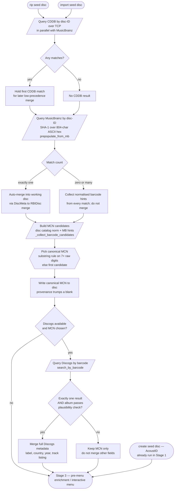
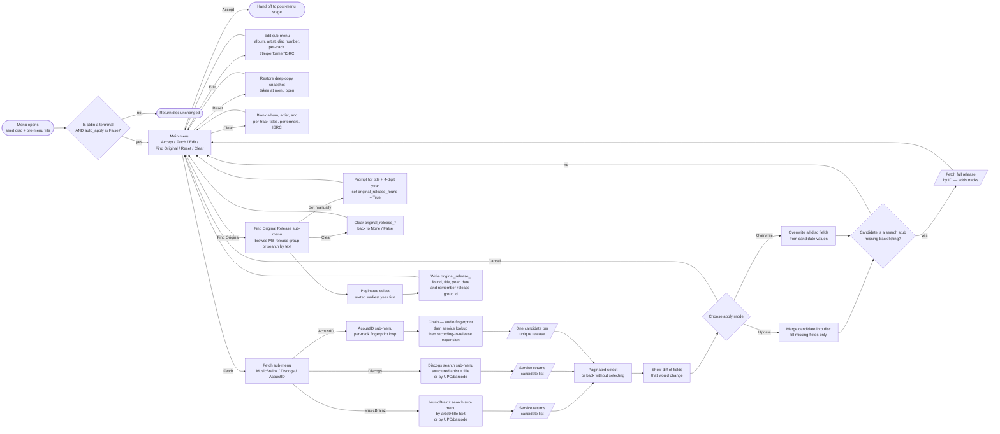
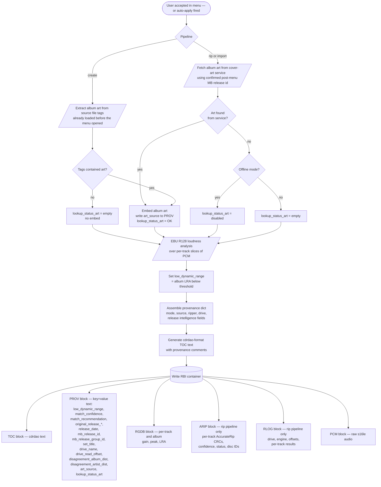

# Metadata Pipeline Overview

> **Purpose**: Cross-cutting view of how album, artist, track, and release-intelligence metadata are sourced, merged, and ultimately written into an RBI container — across the create, rip, and import pipelines.

## Audience

This document is for engineers porting the metadata pipeline to another language, or onboarding to the project. It deliberately collapses module-internal detail and surfaces the orchestration: **which services are queried, in which order, at which pipeline stage, gated by which conditions, and how the result lands on disk**.

For per-module detail (data shapes, error paths, individual algorithms), see the corresponding `docs/flow/<module>.md` documents once they exist; for now, the inline file:line citations are the navigation aid.

## Overview

`cdda2img` has three pipelines that build an RBI container: **create** (audio files), **rip** (physical disc), and **import** (foreign disc image). All three converge on the same logical disc representation and the same interactive confirmation step, but they differ in:

- which local-source metadata extraction they run first;
- which network services they pre-populate from before the menu opens;
- whether they have AccurateRip / rip-log artefacts to record alongside the metadata;
- whether a high-confidence automatic match can skip interactive confirmation.

The metadata pipeline is itself layered:

1. **Local-source extraction** (no network) — embedded file tags, or the metadata regions of a foreign disc image (cdrdao TOC text, DDP DDPID/PQDESCR/CDTEXT.BIN, NRG CDTX, CCD index + CD-Text). Produces a seed disc with whatever the source itself carries.
2. **Pre-menu network lookups** (automatic) — fired *before* the interactive menu opens. Each has its own auto-apply gate; some are silently skipped on multiple matches, some auto-apply the first match unconditionally. The rip and import pipelines query CDDB, MusicBrainz, Discogs, and AcoustID. The create pipeline queries AcoustID only (CDDB, MusicBrainz, and Discogs are disabled because no disc fingerprint is available).
3. **Pre-menu original-release lookup and confidence scoring** — original-release identification runs before the menu in all three pipelines so the menu can display the original-release result in its initial summary. Discogs R11 corroboration and match-confidence computation additionally run before the menu in all three pipelines; a STRONG confidence score (≥ 0.70) or an explicit `--auto` flag causes the menu step to be skipped automatically. In the create pipeline, STRONG is unreachable via automatic signals alone (the only live signal is AcoustID corroboration at +0.25, below the 0.70 threshold), so the menu always opens unless `--auto` is passed explicitly.
4. **Menu-driven interaction** (always interactive on a TTY, unless auto-apply fires) — the user presses keys in the metadata menu to trigger a MusicBrainz text search, a Discogs search, an AcoustID per-track fingerprint, or to open the original-release finder. Each result is shown with a diff and confirmed (update missing fields, or overwrite all).
5. **Post-menu enrichment** — album art is fetched and embedded. EBU R128 loudness analysis runs and sets the low-dynamic-range flag. In the rip and import pipelines, album art comes from a MusicBrainz cover-art service lookup using the confirmed post-menu release id. In the create pipeline, album art comes from tags already embedded in the source audio files — no network call is needed.
6. **Container write** — the accumulated disc is serialised into the RBI container blocks: TOC (cdrdao text), PROV (release intelligence as key/value text), RGDB (per-track loudness), ARIP (AccurateRip results, rip pipeline only), RLOG (structured rip log, rip pipeline only).

## Merge confluence: `_merge_into_disc`

The DiscMeta-to-RBIDisc merge is the confluence point. The actual merge step is `mb_lookup._merge_into_disc(meta, disc) -> RBIDisc` (and its sibling `_overwrite_disc` for the menu's "Overwrite All" mode), which goes directly from a remote result (DiscMeta) into the working disc record (RBIDisc). See `mb_lookup.py:_merge_into_disc` (single-match path, R1 disambiguation path, R4 ISRC tally path) and `_overwrite_disc` (menu override path).

## Invariants and Constraints

These rules are not visible in the flowcharts; they govern which arrows are followed. A reimplementation that ignores any of these will produce subtly wrong metadata.

### Auto-apply gates (pre-menu)

- **CDDB pre-population holds the first match and applies it last, as fill-blank.** Server returns multiple matches → first one wins, by server ordering. The result is not applied immediately; it is held and merged only after MusicBrainz, Discogs, and AcoustID have had their chance, filling only fields those richer sources did not populate. The user is not asked.
- **MusicBrainz disc-ID pre-population auto-applies only when there is exactly one match.** Zero or multiple matches → the disc is returned unchanged, but normalised 13-digit barcode hints from every returned match are still collected and forwarded to the Discogs step.
- **Discogs barcode pre-population auto-merges only when both** (a) exactly one search result returns, **and** (b) the result's album passes a substring/separator-asymmetry plausibility check against the working disc's album. Anything else → the canonical MCN is still written to the disc (because a populated MCN is more useful than a blank one, and the menu's edit flow can correct a wrong guess), but no other fields are merged.

### Match-confidence auto-apply gate

- Match confidence is computed from additive signals and compared to fixed thresholds to yield one of four recommendation levels: STRONG, MEDIUM, LOW, or NONE. This computation runs in all three pipelines.
- **A STRONG recommendation (score ≥ 0.70) or an explicit `--auto` flag causes the interactive metadata menu to be skipped automatically** — the disc is returned with whatever metadata the automatic lookups merged.
- In the create pipeline, CDDB, MusicBrainz, and Discogs lookups are disabled (no disc fingerprint is available to query by). The only automatic pre-menu lookup is AcoustID corroboration (+0.25). Because no other positive signal is reachable, STRONG (≥ 0.70) is never reached via automatic means in the create pipeline, and the menu always opens unless `--auto` is passed explicitly.
- No single signal reaches the STRONG threshold alone. A disc-ID fingerprint match alone scores 0.50 (MEDIUM). A disc-ID match plus AcoustID corroboration scores 0.75 (STRONG). A disc-ID match plus ISRC disambiguation alone scores 0.65 (MEDIUM). Effective auto-apply therefore requires corroboration from at least two independent signals.
- A text-plus-duration MB match contributes only +0.20 (versus +0.50 for a disc-ID fingerprint match). Even with AcoustID corroboration (+0.25) and ISRC disambiguation (+0.15), the ceiling is 0.60 — below the STRONG threshold. A text+duration-matched release can **never** reach STRONG and therefore can never auto-apply.
- The CDDB/MB disagreement penalty (−0.10) can push a borderline STRONG down to MEDIUM.

### Canonical MCN selection rule

- Candidates are assembled from the normalised disc catalog (when it already normalises to 13 digits) plus any barcode hints from MusicBrainz, de-duplicated in order.
- Selection is **deductive**: if the disc's raw catalog string contains 7 or more raw digits that appear as a substring of any candidate, that candidate wins. The reasoning is that printed barcodes are typically GTIN-12 without the check digit, which is a substring of GTIN-13 — substring bridges all three.
- Otherwise the first candidate wins (best guess fallback). The menu's edit flow lets the user override.

### Manual-override gate on original release

- `populate_original_release` returns immediately when `original_release_found` is already True. The user can set this manually inside the metadata menu's "Find Original Release" sub-menu; the pre-menu auto-population (which runs in all three pipelines) must not overwrite that. The idempotent gate is the mechanism that makes a second call after the menu a safe no-op.

### Original-release derivative rejection

- A MusicBrainz release group whose secondary types include any of: Compilation, Live, Remix, DJ-mix, Mixtape/Street, Demo, Interview, Audiobook, Audio drama, Spokenword — is **rejected** as an "original release" candidate. Its first-release-date is the date of the derivative work, not of the underlying album. When the primary release-group path rejects on this rule, the fuzzy fallback runs instead.

### Fuzzy fallback acceptance rule

- Title normalisation strips a research-derived allow-list of reissue tokens (Remastered, Deluxe, Anniversary, etc., longest-first to avoid collisions).
- Deny-list rules reject pairs differing in: live/studio markers, roman-numeral suffixes (asymmetric or differing), arabic-numeral suffixes (differing), volume/part numbers (differing), or any "re-recording" marker on either side.
- Scoring uses a token-set ratio fuzzy match against a fixed threshold of 88. Among candidates passing the threshold, **earliest year wins**; tie-broken by highest score.

### R9 disagreement detection

- The disagreement check compares the pre-MusicBrainz album/artist (from CDDB or embedded metadata) against the MusicBrainz candidate's album/artist using a **pattern-weighted edit distance** measure, not a simple equality check.
- Before the distance is computed, both strings are normalised: Unicode composition, case-fold, and a short allow-list of release-suffix tokens (Remastered, Deluxe Edition, Anniversary Edition, etc.) are stripped from both sides. These expected differences between CDDB's pressing title and MusicBrainz's canonical title are not disagreement.
- Disagreement fires when the weighted distance exceeds 0.15. Below this threshold, minor punctuation and article differences are ignored. The threshold is symmetric: the same rule applies to album and to artist independently.
- When disagreement fires: `disagreement_cddb_mb` is written to PROV as a comma-separated list of affected fields (`album`, `artist`, or `album,artist`), and the numeric distance for each affected field is stored separately (`disagreement_album_dist`, `disagreement_artist_dist`). These float values are formatted to three decimal places.
- The distance is computed by: normalising to lowercase ASCII, stripping non-alphanumeric characters, then applying a normalised edit distance. Innocuous patterns (leading articles, featuring credits, EP/Single markers, parentheticals, part numbers, "&" → "and") reduce the effective distance at a per-pattern weight between 0.0 (fully ignored) and 1.0 (full weight). The comparison is **suppressed** when either side is blank — both the album and artist comparisons only fire when both values are non-empty. "Unknown Artist" on the pre-MB side additionally suppresses the artist comparison (it is a raw default, not a CDDB result).

### MusicBrainz disc-ID computation

- The disc ID is the URL-safe base64 of SHA-1 over an **804-character ASCII uppercase-hex string**, not the raw binary integers. A reimplementation that hashes raw bytes will produce a valid-looking but wrong ID that the service silently rejects.

### Interactive-step ordering

- In the create pipeline, **`derive_album_info` opens its own interactive accept/edit prompt** for album title and album artist, *before* the metadata menu opens. There are two distinct interactive stages in the create pipeline, not one.
- In the rip and import pipelines, there is no `derive_album_info` step; the seed metadata comes from the local source (CD-Text, DDP descriptors, or whatever the rip path captured) and from CDDB/MusicBrainz/Discogs/AcoustID pre-population, and the metadata menu is the only interactive step.
- All three pipelines compute match confidence and have an auto-apply gate. However, in the create pipeline the gate is only reachable via the explicit `--auto` flag (automatic signals cannot reach STRONG); in the rip and import pipelines the gate fires automatically on disc-ID + AcoustID corroboration (or other combinations reaching ≥ 0.70).

### Loudness must precede provenance assembly

- EBU R128 loudness analysis writes `low_dynamic_range` onto the disc; the provenance dict is assembled from the disc after loudness has run. Reordering these two steps will leave `low_dynamic_range` out of the PROV block.

### Pre-menu original release in all pipelines

- All three pipelines run `populate_original_release` **before** the metadata menu opens, so the menu displays the original-release result as part of its initial summary. The create pipeline does this after its pre-menu AcoustID corroboration step and album-art tag extraction; the rip and import pipelines do it inside `_finalize_import` after the network lookups complete.
- Discogs R11 corroboration and match-confidence computation run before the menu in all three pipelines. In the create pipeline, match confidence is computed but STRONG is unreachable via automatic signals (see the auto-apply gate above), so the menu always opens unless `--auto` is passed.
- The manual-override gate in `populate_original_release` is idempotent: if the user sets the original release inside the menu, any subsequent call skips silently because `original_release_found` is already True.

### TTY gating

- The metadata menu returns the disc unchanged when standard input is not a terminal.
- Auto-apply also returns the disc unchanged (disc holds the auto-merged state; no interactive prompt is needed).
- The interactive AccurateRip drive-offset confirmation prompt is skipped when not a terminal.
- The auto-create-config-from-example prompt is also TTY-gated.

## Data Shapes

| Direction | Shape | Notes |
|-----------|-------|-------|
| Local source → seed disc | A full disc record with timing populated and whatever titles/ISRC/MCN the source could extract | Source-specific extractors all produce the same disc structure; downstream code is source-agnostic |
| Remote service → candidate | One or more candidate disc descriptions, each a flat record of optional fields (album, artist, catalog/MCN, MusicBrainz release id, MusicBrainz release-group id, Discogs release id, release date, original release date, country, label, label catalogue number, disc number, disc total, set title, source-tag) plus an optional per-track list | Sources are tagged with the originating service so downstream logic can prefer or reject by provenance |
| Candidate → working disc | A merge step that takes one candidate and one working disc, returns a new working disc with either (update) missing fields filled in from the candidate, or (overwrite) all candidate fields replacing existing values | The two merge modes are user-selected in the confirmation step |
| Post-lookup disc + provenance → match distance | A float confidence score in [0, 1] and a four-level recommendation (STRONG / MEDIUM / LOW / NONE) | All three pipelines; score is additive over named signals then clamped; thresholds are fixed constants; in the create pipeline STRONG is unreachable via automatic signals alone |
| Final disc + extras → container | One disc record + optional packed loudness block + optional AccurateRip block + optional rip-log block + a key/value provenance dict | Container writer serialises into TOC, PROV, RGDB, ARIP, RLOG, PCM blocks in that order |

## Stage 1 — Pipeline Entry and Local-Source Extraction

The three pipelines diverge on which local source they extract from, then converge on the same metadata orchestration.

```mermaid
flowchart TD
    create_in([create pipeline — audio file directory])
    rip_in([rip pipeline — physical disc])
    import_in([import pipeline — foreign disc image])

    create_in --> create_tags[/Read embedded file tags<br/>via audio tag reader/]
    create_tags --> create_confirm{{Confirm or edit<br/>album and artist<br/>derive_album_info}}
    create_confirm --> create_seed[Seed disc — album, artist, track timing]
    create_seed --> create_r6[/AcoustID fingerprint of<br/>first and middle tracks/<br/>pre-menu corroboration]
    create_r6 --> create_r6_out[Merge consistent AcoustID<br/>release fields into disc;<br/>set acoustid_corroborates in provenance]

    rip_in --> rip_resolve[Resolve drive read offset<br/>per-drive config → AccurateRip catalog → 0]
    rip_resolve --> rip_capture[Capture audio + subchannel data<br/>cdrdao primary, cd-paranoia fallback]
    rip_capture --> rip_seed[Seed disc — MCN, per-track ISRC,<br/>CD-Text titles where present]

    import_in --> import_branch{Foreign image type}
    import_branch -- cdrdao TOC+BIN --> imp_toc[Parse cdrdao TOC text<br/>album, artist, MCN, per-track ISRC, titles]
    import_branch -- DDP 2.0 --> imp_ddp[Parse DDPID, PQDESCR, CDTEXT.BIN<br/>MCN, ISRC, titles, performers]
    import_branch -- Nero NRG --> imp_nrg[Parse NER5 or NERO + CDTX + MTYP<br/>titles, performers, ISRC]
    import_branch -- CloneCD CCD/IMG --> imp_ccd[Parse CCD index + embedded CD-Text<br/>titles, performers]
    imp_toc --> import_seed[Seed disc — local metadata only]
    imp_ddp --> import_seed
    imp_nrg --> import_seed
    imp_ccd --> import_seed

    create_r6_out --> network_stage([Stage 2 — pre-menu network lookups])
    rip_seed --> network_stage
    import_seed --> network_stage
```

### Step Descriptions

1. **Create pipeline entry**: A directory of audio files is the input. No physical disc, no foreign image.
2. **Read embedded file tags**: The first readable file is scanned for an album-artist tag (a fixed priority list of tag names) and an album tag. The parent directory name is the fallback for the album.
3. **Confirm or edit album and artist**: An interactive accept/edit prompt opens for the album title and album artist. This is a separate interactive step that runs *before* the main metadata menu opens later in the pipeline. See `metadata.py:_confirm`.
4. **Create seed disc**: The seed disc carries the confirmed album and artist plus per-track timing derived from the transcoded WAV durations. Track titles are blank at this point.
5. **Pre-menu AcoustID corroboration (create pipeline)**: Audio fingerprints are generated for the first track and the middle track (when two or more tracks are present) using the already-transcoded per-track WAV files. Each fingerprint is submitted to the AcoustID service to retrieve candidate release records. If the same release appears consistently across all fingerprinted tracks and the disc already has a MusicBrainz release id (from an earlier source), `acoustid_corroborates` is set to YES or NO. If the disc has no release id yet and all fingerprinted tracks agree on a single release, that release's album-level fields are merged in (the pressing-level release id is cleared, because fingerprints identify recordings shared across pressings, not a specific pressing). `lookup_status_acoustid` is written to provenance. This step is skipped when the AcoustID tool or API key is unavailable. See `cdda2img.py:_r6_acoustid_corroborate_wavs`.
6. **Rip pipeline entry**: A physical optical drive is the input.
7. **Resolve drive read offset**: A three-tier lookup determines the read offset to apply. User-confirmed per-drive config entries always win; otherwise the AccurateRip catalog is consulted (auto-apply at three or more submissions; interactive prompt at lower confidence on a terminal); otherwise zero with a warning. See `cdda2img.py:_resolve_drive_offsets`.
8. **Capture audio and subchannel data**: cdrdao is the primary ripper (captures MCN, per-track ISRC, and CD-Text from the subchannels); cd-paranoia is the fallback (no subchannel data). The returned disc has track timing and whatever subchannel metadata could be read.
9. **Create rip seed disc**: Whatever MCN, ISRC, and CD-Text titles came back from the subchannel scan are present on the seed. Album and artist may be blank.
10. **Import pipeline entry**: A foreign disc image path is the input. The suffix or directory shape selects the parser.
11. **Branch on foreign image type**: A four-way branch over file extension and directory shape.
12. **Parse cdrdao TOC+BIN**: The text TOC is parsed by the shared TOC parser; titles, performer, MCN, and ISRC come from the TOC text. See `cdrdao_reader.py:parsed_to_rbi_disc`.
13. **Parse DDP 2.0**: DDPID supplies the MCN; PQDESCR supplies per-track timing and ISRC; CDTEXT.BIN supplies titles and performers. See `ddp_reader.py:_parse_ddp`.
14. **Parse Nero NRG**: NER5 (64-bit offsets) or NERO (32-bit) DAOX/DAOI blocks supply timing; CDTX supplies CD-Text; MTYP is consulted. See `nrg_reader.py:_parse_nrg`.
15. **Parse CloneCD CCD/IMG**: The text index supplies timing; embedded CD-Text packs (if present) supply titles and performers. See `ccd_reader.py:_parse_ccd_image`.
16. **Create import seed disc**: All four parsers produce the same disc shape. Downstream stages are source-agnostic.
17. **Hand off to the network stage**: All three pipelines now hold a seed disc with track timing. What's missing — album, artist, titles, release year, label, country — is filled in by Stage 2 and the metadata menu.

## Stage 2 — Pre-Menu Network Lookups (automatic, gated)

These lookups fire before the metadata menu opens. The create pipeline runs AcoustID corroboration only (already shown as step 5 in Stage 1, before the seed disc is handed to Stage 2). The rip and import pipelines both run CDDB, MusicBrainz, Discogs, and AcoustID via the shared finalisation step. CDDB runs in parallel with MusicBrainz so a slow server never delays the rip; CDDB results are applied last (lowest precedence) as a zero-trust gap-filler.



### Step Descriptions

1. **Query CDDB**: Rip and import pipelines. A TCP session computes the CDDB disc ID from the disc's track LSNs and lead-out LSN, then queries the configured server. The query runs in parallel with the MusicBrainz lookup so a slow server never delays the pipeline. CDDB results are held and applied last (lowest precedence). See `cddb.py:prepopulate_from_cddb`; called from `_finalize_import` via `_run_metadata_lookups`.
2. **Branch on CDDB matches**: Zero matches → no CDDB result. Any matches → the first match is held for later.
3. **Hold first CDDB match**: The first CDDB match is noted but not applied yet; it will be merged after MusicBrainz, Discogs, and AcoustID have all had their turn, so it only fills fields no richer source could provide.
4. **Query MusicBrainz by disc ID**: Rip and import pipelines. The disc ID is computed in pure code by hashing the 804-character ASCII uppercase-hex representation of the TOC, then URL-safe base64 encoding. See `mb_lookup.py:prepopulate_from_mb`.
5. **Branch on MusicBrainz match count**: Exactly one → auto-merge. Zero or multiple → no merge.
6. **Auto-merge MusicBrainz result**: The candidate is merged into the working disc; existing non-blank fields are preserved.
7. **Collect barcode hints**: Even when no merge happens, every match's normalised 13-digit barcode is collected. These hints feed the Discogs step when the disc has no embedded MCN.
8. **Build MCN candidate list**: The disc's existing catalog (if it normalises to 13 digits) plus the de-duplicated barcode hints from MusicBrainz, in order. See `cdda2img.py:_collect_barcode_candidates`.
9. **Pick canonical MCN**: The deductive rule (7+ raw digits as substring of a candidate) runs first; otherwise the first candidate wins. See `cdda2img.py:_pick_canonical_mcn`.
10. **Write canonical MCN**: The chosen MCN is written to the disc even when the rest of the Discogs step bails out, because a populated MCN is more useful than a blank one and the menu's edit flow can correct it.
11. **Check Discogs availability and MCN**: The Discogs step bails out when no MCN was chosen or when the Discogs library/token is not configured.
12. **Query Discogs by barcode**: See `discogs_lookup.py:search_by_barcode`.
13. **Branch on Discogs result count and plausibility**: Exactly one result AND its album passes the substring/separator-asymmetry guard against the working disc's album.
14. **Merge Discogs metadata**: Label, country, year, and track listing are merged in.
15. **Keep MCN only**: The merge is skipped, but the MCN already written in step 10 remains.
16. **Hand off to the next stage**: All three pipelines now have whatever the local sources and the auto-apply network lookups could produce.

## Stage 2b — Pre-Menu Original Release and Confidence Scoring

All three pipelines run the original-release lookup and match-confidence scoring before the menu opens. In the create pipeline this runs after the pre-menu AcoustID corroboration (Stage 1 step 5) and album-art extraction; in the rip and import pipelines it runs at the end of `_finalize_import` after all network lookups complete. The STRONG auto-apply gate fires in all pipelines — but in practice it is only reachable in the rip and import pipelines via automatic signals; the create pipeline requires an explicit `--auto` flag.

```mermaid
flowchart TD
    after_lookups([After Stage 2 — all pipelines])

    after_lookups --> orig_gate{original_release_found<br/>already True?}
    orig_gate -- yes --> orig_skip[Skip auto-lookup<br/>user already set it manually<br/>in a prior menu session]
    orig_gate -- no --> orig_primary{{Working disc has a<br/>MusicBrainz release-group id?}}

    orig_primary -- yes --> rg_fetch[/Fetch release group<br/>by id/]
    rg_fetch --> rg_check{Release group has any<br/>derivative secondary type<br/>Compilation, Live, Remix...?}
    rg_check -- yes --> orig_fuzzy
    rg_check -- no --> rg_year{First-release-date<br/>parses to a year?}
    rg_year -- yes --> orig_set[Set original_release fields<br/>found, title, year]
    rg_year -- no --> orig_fuzzy

    orig_primary -- no --> orig_fuzzy[Fuzzy fallback<br/>find_original_release_fuzzy]
    orig_fuzzy --> have_at{Disc has both<br/>artist and album?}
    have_at -- no --> done_no[Return found=False]
    have_at -- yes --> cat_search[/Artist+album text search<br/>against service catalogue/]
    cat_search --> cat_filter[Deduplicate by release-group<br/>extract title + year per release]
    cat_filter --> deny[Apply deny-list rules<br/>live vs studio, roman numerals,<br/>volume numbers, re-recordings]
    deny --> norm[Normalise titles<br/>strip allow-list of reissue tokens<br/>year qualifiers, disc tags]
    norm --> score[Score each candidate<br/>token-set ratio]
    score --> threshold{Any candidate<br/>scores at least 88?}
    threshold -- no --> done_no
    threshold -- yes --> earliest[Earliest year wins<br/>tie-break on highest score]
    earliest --> orig_set

    orig_set --> r11
    orig_skip --> r11
    done_no --> r11

    r11{Both MB original-release year<br/>AND Discogs release id present?}
    r11 -- no --> match_conf
    r11 -- yes --> dg_master[/Look up Discogs master year<br/>via release id/]
    dg_master --> r11_cmp{Years agree?}
    r11_cmp -- yes --> r11_ok[Emit original_release_corroborated<br/>= discogs,mb to PROV]
    r11_cmp -- no --> r11_dis[Emit original_release_disagreement<br/>to PROV; adopt the earlier year]
    r11_ok --> match_conf
    r11_dis --> match_conf

    match_conf[Compute match confidence<br/>build_match_distance — all pipelines]
    match_conf --> conf_emit[Write match_confidence<br/>and match_recommendation to PROV]
    conf_emit --> auto_gate{Recommendation STRONG<br/>or --auto flag set?}
    auto_gate -- yes --> auto_msg[Print auto-confirm message<br/>skip interactive menu]
    auto_gate -- no --> menu_stage([Stage 3 — interactive metadata menu])
    auto_msg --> post_menu([Stage 4 — album art, loudness, container])
```



### Step Descriptions

1. **Original-release gate**: Returns immediately when `original_release_found` is already True — this happens when the user set the field manually inside the menu during a prior session (the disc is passed in from the caller with that state already baked in). See `original_release.py:populate_original_release`.
2. **Primary path — release-group id check**: Only runs when the working disc has a MusicBrainz release-group id (set by an earlier merge from disc-ID prepop or from a menu-driven MusicBrainz selection).
3. **Fetch release group by id**: A service call retrieves the release-group record.
4. **Reject derivative release groups**: If any of Compilation, Live, Remix, DJ-mix, Mixtape/Street, Demo, Interview, Audiobook, Audio drama, Spokenword appears in the secondary-type list, the primary path is abandoned and the fuzzy fallback runs. The first-release-date of a derivative release group is the date of the derivative, not of the underlying album.
5. **Parse first-release-date to a year**: A four-digit year is required. Other formats fall through to the fuzzy path.
6. **Set original release fields**: `original_release_found` becomes True; title comes from the release-group title (or the disc album as fallback); year is the parsed year.
7. **Fuzzy fallback entry**: Runs when the primary path was skipped or rejected.
8. **Artist and album required**: Both must be non-empty; otherwise return not-found.
9. **Artist + album text search**: A service text-search query is built from the artist and album; up to fifty results are fetched.
10. **Deduplicate and extract**: Results are deduplicated by release-group id; each yields a (title, year) pair using release-group first-release-date only (R5: candidates without one are skipped — the per-release-date fallback admitted pre-album promo pressings as "the original").
11. **Apply deny-list rules**: Pairs differing in live vs studio markers, roman-numeral suffixes, volume/part numbers, arabic-numeral suffixes, or with re-recording markers on either side are rejected.
12. **Normalise titles**: Both sides are run through the title normaliser — strips year qualifiers in brackets, disc-number tags, the longest-first allow-list of reissue tokens, leading "the", and remaining punctuation. The result is the comparable stem.
13. **Score each candidate**: Token-set ratio between the normalised disc title and each normalised candidate title.
14. **Threshold check**: Candidates scoring below 88 are dropped.
15. **Earliest wins**: Among remaining candidates, the earliest year wins; ties broken on highest score. The winning (title, year) becomes the original release.
16. **R11 gate**: Fires in all three pipelines, but in practice only the rip and import pipelines run Discogs pre-menu, so the gate only produces output there. Fires only when both a MusicBrainz original-release year and a Discogs release id are present on the disc. See `cdda2img.py:_r11_corroborate_with_discogs_master`.
17. **Look up Discogs master year**: The Discogs master record associated with the release is fetched; its earliest-known year is extracted.
18. **Years agree**: Both sources produced the same four-digit year — emit `original_release_corroborated=discogs,mb` to PROV. No change to the disc's year.
19. **Years disagree**: Both sources are present but give different years — emit `original_release_disagreement=discogs:YYYY|mb:YYYY` to PROV and adopt the earlier of the two (prefer-the-earlier rule).
20. **Compute match confidence**: All automatic lookup signals are now baked into the provenance dict. `build_match_distance` inspects the post-lookup disc and provenance and computes an additive confidence score. Runs in all three pipelines. See Algorithm Notes.
21. **Emit confidence and recommendation**: `match_confidence` (float to three decimal places) and `match_recommendation` (one of strong/medium/low/none) are written to PROV in all pipelines.
22. **STRONG gate**: Score ≥ 0.70 or an explicit `--auto` flag → the interactive menu is bypassed; a short auto-confirm message is printed and control passes directly to Stage 4. In the create pipeline, STRONG via automatic signals is unreachable (max automatic score = +0.25 from AcoustID); only `--auto` triggers this path in create.
23. **Proceed to interactive menu**: Score below STRONG and no `--auto` flag → Stage 3 runs as normal.

## Stage 3 — Interactive Metadata Menu

The menu is the convergence point of all three pipelines. It opens after Stage 2 (and Stage 2b for rip/import). For the rip and import pipelines, the menu may be bypassed entirely by the auto-apply gate in Stage 2b.



### Step Descriptions

1. **Menu opens**: A deep-copy snapshot of the disc is taken for the Reset option. Seed artist and seed title strings are remembered as immutable search anchors. See `metadata_menu.py:run_metadata_menu`.
2. **TTY and auto-apply gate**: The menu returns the disc unchanged when **either** standard input is not a terminal (batch mode) **or** the `auto_apply` flag is True (STRONG confidence from Stage 2b). When auto-apply fires, the disc already holds whatever the automatic lookups merged — the menu skips without additional modification. See `menu_state.py:MenuController.run`.
3. **Main menu**: Six commands — Accept, Fetch, Edit, Find Original Release, Reset, Clear.
4. **Accept**: Returns the disc to the post-menu stage.
5. **Edit**: Direct edits to album, artist, disc number, and per-track title/performer/ISRC. No network. See `metadata_menu.py:_edit_menu`.
6. **Reset**: Restores the deep-copy snapshot taken when the menu opened. Also clears the remembered MusicBrainz release-group id.
7. **Clear**: Blanks album, artist, and every per-track title/performer/ISRC, preserving timing.
8. **Fetch sub-menu**: Three remote sources — MusicBrainz, Discogs, AcoustID.
9. **MusicBrainz search sub-menu**: Either an artist+title text search (built into a field-qualified Lucene query) or a UPC/barcode search.
10. **Discogs search sub-menu**: Either a structured artist+title search (more precise than a free-text query) or a UPC/barcode search.
11. **AcoustID sub-menu**: Lists tracks; the user picks one (or supplies an external file path). For each chosen track, the create pipeline reuses the per-track WAV; the rip and import pipelines extract a per-track WAV slice from the raw PCM on demand and cache it.
12. **AcoustID chain**: For each chosen track, the audio fingerprint is extracted by an external fingerprint tool, sent to the AcoustID service for recording matches, and each recording is then expanded to one candidate per unique release via a service follow-up call. Single-track candidates are tagged with the user-supplied track number so the merge targets the right track. See `acoustid_lookup.py:fingerprint_and_lookup`.
13. **Paginated select**: Ten results per page; user navigates and picks a candidate, or backs out.
14. **Show diff**: Each field that would change is printed with old and new values. New ISRC values for previously blank fields are shown explicitly.
15. **Choose apply mode**: Update (fill missing fields only) or Overwrite (replace existing). This is the user-facing confluence point. See `metadata_menu.py:_confirm_apply`.
16. **Merge candidate into disc — update**: Existing non-blank fields are preserved; only missing ones are filled. See `mb_lookup.py:_merge_into_disc`.
17. **Overwrite candidate into disc**: Candidate fields replace existing ones where the candidate has a value. See `mb_lookup.py:_overwrite_disc`.
18. **Candidate-is-a-stub check**: Search-result objects often carry no track listing. When the candidate carries a service release id but no tracks, a second call fetches the full release (with tracklist) and that fuller candidate is used for the merge.
19. **Find Original Release sub-menu**: Manual entry, MusicBrainz search, or clear. Search uses the remembered release-group id (if any) to enumerate the group; otherwise it does an artist+title text search.
20. **Original release — paginated select**: Results sorted oldest-first.
21. **Apply original release**: The four fields `original_release_found`, `original_release_title`, `original_release_year`, `original_release_date` are populated from the chosen release. The MusicBrainz release-group id of the chosen release is remembered for subsequent sub-menu use.
22. **Set original manually**: The user types a title and 4-digit year; `original_release_found` is set to True. Any subsequent call to `populate_original_release` — such as an app restart that re-runs the pipeline with a cached disc — will skip silently because the manual-override gate fires.
23. **Clear original**: Resets the four original-release fields to None/False. The next time the pre-menu original-release lookup runs, it will try again.

## Stage 4 — Post-Menu Enrichment and Container Write

After the user accepts in the metadata menu (or after auto-apply fires), album art is sourced, loudness is analysed, and the container is written.



### Step Descriptions

1. **User accepted (or auto-apply fired)**: Control returns to the pipeline tail. For the rip and import pipelines this is `_finalize_import`; for create it is the tail of `create_image`.
2. **Album art — rip/import path**: The confirmed post-menu MusicBrainz release id is used to query the cover-art service. See `album_art.py:fetch_cover`.
3. **Album art — create path**: Art was extracted from the source audio file's embedded tags before the menu opened. The decoded bytes are available immediately after the menu returns; no network call is needed. See `album_art.py:cover_from_file_tags`.
4. **Art found (service or tags)**: Art is encoded and attached to the container. `art_source` and `lookup_status_art=OK` are written to PROV. All three pipelines write `lookup_status_art`; `art_source` is written in the rip and import pipelines (where the art comes from the cover-art service and the source URL is available).
5. **Service art not found — offline mode**: `lookup_status_art=disabled` is written to PROV.
6. **Service art not found — network mode**: `lookup_status_art=empty` is written to PROV.
7. **EBU R128 loudness analysis**: Per-track slices of the PCM are analysed for integrated gain, true peak, and loudness range. The album LRA is compared to a configurable threshold; below threshold sets `low_dynamic_range` to True, above sets it to False.
8. **Assemble provenance dict**: A flat dict of pipeline-specific keys (mode = create/rip/import, source, ripper, drive name, drive read offset) plus release-intelligence fields written from the disc (low_dynamic_range, original_release_*, release_date, mb_release_id, mb_release_group_id, set_title, match_confidence, match_recommendation, disagreement_album_dist, disagreement_artist_dist, art_source, lookup_status_art). See `cdda2img.py:_add_release_provenance`.
9. **Generate cdrdao-format TOC text**: The disc structure is rendered to cdrdao TOC text, with provenance lines as comments.
10. **Write RBI container**: All blocks are written in order — TOC, PROV, RGDB, ARIP, RLOG, PCM — followed by the block directory. See `container.py:build_container`.
11. **TOC block**: cdrdao TOC text.
12. **PROV block**: UTF-8 key=value lines. Always carries creator and created (UTC ISO timestamp); the rest depends on which pipeline ran and which release-intelligence fields are populated. All three pipelines include `match_confidence` and `match_recommendation`. `disagreement_album_dist` / `disagreement_artist_dist` are included when the R9 disagreement check fired (rip and import only, since CDDB and MB are both needed). `art_source` is included when the cover-art service fetch succeeded (rip and import pipelines only — the source URL is available from the service response). `lookup_status_art` is written by all three pipelines.
13. **RGDB block**: Per-track and album EBU R128 gain, peak, and LRA as float32. Present only when loudness analysis ran.
14. **ARIP block**: Per-track AccurateRip v1 and v2 CRCs, confidences, status, plus the two disc IDs and the CDDB id. Present only in the rip pipeline.
15. **RLOG block**: Structured rip log with drive, engine, offsets, and per-track results. Present only in the rip pipeline.
16. **PCM block**: Raw s16le audio, no WAV header (PCM parameters are in the fixed file header).

## Error Handling

| Failure | Trigger | Response | Caller receives |
|---------|---------|----------|-----------------|
| CDDB network error or no match | Socket error, unexpected greeting, or 202 response | Silent; logged at WARNING for network errors only | Disc returned unchanged from `prepopulate_from_cddb` |
| MusicBrainz disc-ID lookup error | Service ResponseError or NetworkError | Silent; logged at DEBUG | Disc returned unchanged with zero barcode hints, match_count=0 |
| MusicBrainz disc-ID returns multiple matches | More than one match | No merge; barcode hints from every match still collected | Disc returned unchanged; barcode hints forwarded to Discogs step |
| Discogs token missing or library missing | Environment variable not set or import fails | `is_available()` returns False; all functions return empty lists | Discogs step bails out; canonical MCN (if chosen) still written |
| Discogs returns zero or many results, or album fails plausibility check | Result count not 1, or `_albums_match` returns False | No merge; MCN already written | Pre-menu Discogs step returns disc with MCN populated only |
| AcoustID unavailable — pre-menu R6 (all pipelines) | API key unset, client library not installed, or native fingerprint binary missing from PATH | `lookup_status_acoustid` set to disabled; step skipped silently | Disc unchanged; `acoustid_corroborates` absent from provenance (no signal contribution to match confidence) |
| AcoustID unavailable — menu-driven (interactive) | Same as above, detected when user invokes the AcoustID sub-menu | Menu shows unavailability reason and returns to main menu | Disc unchanged from that sub-menu pass |
| AcoustID returns no consistent cross-track match — pre-menu | All per-track hit lists are empty, or no release id appears in every fingerprinted track's results | No merge; `acoustid_corroborates` not set | Disc unchanged; no AcoustID contribution to confidence |
| AcoustID returns no confident matches — menu-driven | All scores below threshold, or no matches at all | "No confident matches found." printed | Disc unchanged from that sub-menu pass |
| R9 disagreement one-sided blank | Pre-MB album or MB album is blank (not both) | Comparison skipped for that field | No disagreement emitted for blank-side comparisons |
| Discogs master year lookup fails (R11) | `lookup_master_year` returns None (no master, network failure, or offline) | R11 step silently skips | No corroboration or disagreement written to PROV |
| Album art fetch fails | Network error, no release id, or offline mode | `lookup_status_art` set to empty or disabled; pipeline continues | No art embedded; PROV records the outcome |
| Original-release primary path rejects (derivative or no year) | Secondary-type intersection non-empty, or first-release-date missing/unparseable | Falls through to fuzzy fallback | Whatever fuzzy returns, or found=False |
| Original-release fuzzy returns no candidate above threshold | No score reaches 88, or deny-list rejects all | Return found=False | Fields remain None/False on the disc |
| Metadata menu opened on non-TTY stdin | `sys.stdin.isatty()` returns False | Menu returns immediately | Disc unchanged; downstream pipeline continues |
| Metadata menu bypassed by auto-apply | STRONG confidence score (≥ 0.70) or explicit `--auto` flag | Menu returns disc unchanged (already holds auto-merged state) | Disc with automatic lookups applied; no interactive confirmation |
| Foreign image parse error (any of TOC/DDP/NRG/CCD) | Missing required block, malformed magic, file not found | Exception raised (FileNotFoundError or ValueError) | Caller's try/finally cleans temp files; main handler prints error and exits non-zero |
| MusicBrainz disc-ID computation on a disc with no tracks | `disc.tracks` is empty | Return None | Lookup short-circuits; no service call made |

## Algorithm Notes

### Match-confidence scoring

- **Objective**: Assign a single confidence score to the automatically assembled metadata so the pipeline can decide whether interactive confirmation is needed. Runs in all three pipelines.
- **Input**: The post-lookup working disc (after MB, CDDB, Discogs, AcoustID, and stage-7 duration-match have all run) and the provenance dict (which captures which signals fired).
- **Signals (additive)**:
  - Disc-ID fingerprint match (MB release id present and `duration_match_release` absent from PROV): +0.50. This is the deterministic, collision-resistant signal.
  - Stage-7 text+duration-match (MB release id present and `duration_match_release` present in PROV): +0.20. These two signals are mutually exclusive.
  - AcoustID corroboration (pre-menu R6 check confirmed the MB release): +0.25.
  - ISRC disambiguation (ISRCs resolved a multi-match disc-ID, per R1): +0.15.
  - CDDB/MB disagreement (R9 fired, indicating the two sources gave conflicting album or artist): −0.10.
- **Score**: Raw sum of contributors, clamped to [0.0, 1.0].
- **Thresholds**: STRONG ≥ 0.70, MEDIUM ≥ 0.40, LOW ≥ 0.10, NONE below 0.10.
- **Auto-apply condition**: STRONG or an explicit `--auto` flag — the menu is bypassed, accepting the automatically merged metadata without user confirmation.
- **Note on reachability**: No single signal reaches STRONG on its own. Effective auto-apply via confidence requires at least disc-ID + AcoustID (0.75). A text+duration-matched release tops out at 0.60 (with AcoustID + ISRC disambiguation, before any penalty) — always below the STRONG threshold, always interactive. In the create pipeline, MB disc-ID lookup, CDDB, and Discogs are disabled, so the only reachable positive signal is AcoustID corroboration (+0.25); STRONG is therefore never reached automatically in create. Only the explicit `--auto` flag bypasses the menu in the create pipeline.

### R9 disagreement detection

- **Objective**: Flag cases where CDDB and MusicBrainz gave meaningfully different album or artist names, as a signal that one source is misidentifying the disc.
- **Input**: The pre-MusicBrainz album/artist values (from CDDB or embedded metadata) and the MusicBrainz candidate's album/artist values.
- **Normalisation** (applied to both sides before comparison): Unicode composition normalisation, case folding, collapse whitespace, and stripping a short allow-list of release-suffix tokens (Remastered, Remaster, Deluxe Edition, Deluxe, Anniversary Edition, Expanded Edition, Expanded, Special Edition) from within brackets. These are expected differences between a pressing title and a canonical album title and should not trigger disagreement.
- **Distance measure**: Normalised character edit distance over ASCII-folded, lowercased, non-alphanumeric-stripped strings. Pattern-weighted adjustments reduce the effective distance for innocuous differences: leading article ("the") reduces at weight 0.1; featuring credits reduce at weight 0.1; EP/Single markers are fully ignored (weight 0.0); parenthetical remarks at weight 0.3; bracketed remarks at weight 0.3; part numbers ("Pt. N") at weight 0.2. "&" is replaced with "and" before processing. When both inputs are absent, distance is 0.0 (both unknown = agreement); when only one is absent, distance is 1.0 (maximally different). The comparison is skipped when either side is blank — the caller's guard ensures the function is only invoked with both sides present.
- **Threshold**: Fire when weighted distance > 0.15. Below this threshold, minor punctuation and article differences are not flagged.
- **Output**: `disagreement_cddb_mb` in PROV (comma-separated list of disagreeing fields). `disagreement_album_dist` and `disagreement_artist_dist` as three-decimal-place floats when the respective field exceeded the threshold.
- **Downstream effect**: `disagreement_cddb_mb` in PROV is read by `build_match_distance` as a −0.10 penalty on the match confidence score.

### Canonical MCN selection

- **Objective**: Pick the most authoritative 13-digit MCN candidate for the working disc.
- **Inputs**: The working disc's existing catalog string, plus a de-duplicated list of normalised barcode hints from every match returned by the MusicBrainz disc-ID lookup.
- **Decision**: Substring match wins when at least seven raw digits from the disc's catalog appear as a substring of any candidate (printed barcodes are GTIN-12 without check digit, which is a substring of GTIN-13). Otherwise the first candidate wins (best-guess fallback). Blank is worse than a wrong guess the user can correct via the menu.
- **Threshold**: The seven-digit floor is chosen to avoid false positives across unrelated hints.

### Original-release primary path

- **Objective**: Find the earliest known release of the same logical album, given a MusicBrainz release-group id.
- **Decision**: Reject derivative release groups by secondary-type intersection; accept the release group's first-release-date when it parses to a four-digit year.
- **Rejection set**: Compilation, Live, Remix, DJ-mix, Mixtape/Street, Demo, Interview, Audiobook, Audio drama, Spokenword.

### Original-release fuzzy fallback

- **Objective**: Same as primary, but for discs where the working disc has no release-group id (e.g. a disc not in the MusicBrainz disc-ID database).
- **Inputs**: Artist and album from the working disc.
- **Candidate generation**: An artist+album text search against the MusicBrainz service, fetching up to fifty releases, deduplicated by release-group id. Each release contributes a (title, year) pair using release-group first-release-date only (R5: candidates without one are skipped).
- **Filtering**: Deny-list rules reject pairs differing in live/studio markers, roman-numeral suffixes, arabic-numeral suffixes, volume/part numbers, or with a re-recording marker on either side.
- **Title normalisation**: Strip year qualifiers in brackets, disc-number tags, a longest-first allow-list of reissue tokens (Super Deluxe Edition, Super Deluxe, Deluxe Edition, Deluxe, Expanded Edition, ..., Mobile Fidelity, ...) — longest-first to avoid partial matches eating shorter tokens. Strip leading "the". Strip remaining punctuation.
- **Scoring**: Token-set ratio fuzzy match between the disc's normalised title and each candidate's normalised title.
- **Acceptance**: Score at least 88. Among accepted candidates, earliest year wins; tie-broken on highest score.
- **Note**: Threshold and algorithm choices are documented in the project's private research file.

### MusicBrainz disc-ID computation

- **Objective**: Compute a service-compatible disc identifier from the TOC.
- **Input layout**: First track number as 2-character uppercase hex, last track number as 2-character uppercase hex, lead-out absolute LBA as 8-character uppercase hex (zero-padded), then ninety-nine 8-character uppercase hex absolute LBAs (one per track, zeroed for unused slots).
- **Hash**: SHA-1 over the concatenated 804-character ASCII text. Not over raw binary integers — that produces a valid-looking but wrong identifier.
- **Encoding**: URL-safe base64 (`+` becomes `.`, `/` becomes `_`, `=` becomes `-`).
- **Track offset**: For each track in the working disc, the absolute LBA used is start_frame + pregap_frames + 150 (the standard 2-second lead-in).
- **Lead-out**: Total disc frames + 150.

### AccurateRip-style barcode normalisation

- **Objective**: Reduce any raw barcode (UPC-A 12, EAN-13, hyphenated, with leading zeros stripped) to a canonical 13-digit GTIN-13 string.
- **Procedure**: Strip everything that is not a digit. If the result is exactly 12 digits, prepend a zero (GTIN-12 to GTIN-13). Accept only when the final length is exactly 13.
- **Rejection**: Anything else (too short, too long, non-numeric after stripping) returns None.

## Platform and Hardware Notes

| Dependency | Assumed platform | Portability note |
|------------|-----------------|------------------|
| External audio fingerprint tool on PATH | Linux/macOS/Windows; needs separate install (libchromaprint and the fpcalc tool) | A reimplementation that bundles its own fingerprint extractor avoids the install-dependency check entirely |
| Environment variable for AcoustID API key (`ACOUSTID_API_KEY`) | Any POSIX-style environment | Portable; consider also reading from the project's TOML config |
| Environment variable for Discogs token (`DISCOGS_TOKEN`) | Any POSIX-style environment | Portable; consider also reading from the project's TOML config |
| TCP outbound to a CDDB server on port 888 | Any TCP-capable host with outbound network | Server availability is fragile (the public CDDB ecosystem has decayed); a reimplementation should make the server endpoint configurable and tolerate the long-term disappearance of that protocol |
| HTTPS to MusicBrainz, Discogs, AcoustID, and cover-art endpoints | Any TCP/TLS-capable host | Portable; rate limits apply (1 req/sec for MusicBrainz; check Discogs terms) |
| Standard-input TTY detection (`isatty()`) gating interactive prompts | POSIX terminal semantics | Portable across POSIX-like terminals; Windows console behaviour for `isatty()` is equivalent. Headless CI must not trigger interactive prompts |
| XDG-style configuration path for the per-drive TOML config | Linux/macOS | Replace with a platform-appropriate config path on Windows; the same TOML schema applies |

## Connects To

- **`cddb.py`** — TCP CDDB query, called from the rip and import pipelines. Produces a disc with album, artist, release year, and per-track titles (applied last, at lowest precedence).
- **`mb_lookup.py`** — MusicBrainz disc-ID lookup (pre-menu), text search (menu), barcode search (menu), release-group lookup (menu and pre-menu original-release primary path), single-release lookup (menu, for stub expansion). Provides the `_merge_into_disc` and `_overwrite_disc` functions used everywhere a candidate is applied to a disc.
- **`acoustid_lookup.py`** — Per-track fingerprint and AcoustID query chained to MusicBrainz recording lookup. Used both pre-menu (R6 corroboration) and menu-driven; produces one candidate per unique release.
- **`discogs_lookup.py`** — Discogs barcode and structured-search queries. Used both pre-menu (barcode auto-merge with strict plausibility gate; R11 master-year lookup) and menu-driven (full search by either MCN or artist+title).
- **`original_release.py`** — Pre-menu lookup in all three pipelines; primary path queries MusicBrainz release-group, fuzzy fallback queries MusicBrainz text search and scores with a fuzzy string matcher.
- **`match_distance.py`** — Computes additive match confidence from the post-lookup disc and provenance dict. Produces the `MatchDistance` and `MatchRecommendation` that drive the auto-apply gate. Used in all three pipelines: `_finalize_import` (rip/import) and `create_image` (create).
- **`string_dist.py`** — Pattern-weighted edit-distance function. Used by the R9 disagreement check in `_emit_r9_disagreement` to measure how far apart CDDB and MusicBrainz album/artist names are.
- **`metadata.py`** — Local-source tag extraction for the create pipeline. Interactive accept/edit prompt for album and artist.
- **`album_art.py`** — Cover-art source in all pipelines. Rip and import: post-menu fetch by MusicBrainz release id from the cover-art service. Create: pre-menu extraction from the source audio file's embedded tags. Result embedded in the RBI container in all cases.
- **`toc_parser.py`** — Parses cdrdao TOC text; used by both the cdrdao-rip integration and the cdrdao-TOC import path.
- **`cdrdao_reader.py`** — cdrdao TOC+BIN import; consumes `toc_parser` output and produces a seed disc.
- **`ddp_reader.py`** — DDP 2.0 import; parses DDPID, PQDESCR, CDTEXT.BIN. Also exports a CD-Text pack parser used by `nrg_reader` and `ccd_reader`.
- **`nrg_reader.py`** — Nero NRG import; parses NER5/NERO + CDTX + MTYP.
- **`ccd_reader.py`** — CloneCD CCD/IMG import; parses the text index and embedded CD-Text.
- **`lookup_result.py`** — Defines the shared candidate-record structure (DiscMeta + TrackMeta). The actual merge into the working disc is done by `mb_lookup._merge_into_disc` / `_overwrite_disc`.
- **`metadata_menu.py`** — The interactive confirmation menu. Orchestrates MusicBrainz, Discogs, AcoustID, and the Find Original Release sub-menu.
- **`menu_state.py`** — `MenuController` drives the menu stack. Accepts `auto_apply` flag; returns disc unchanged without entering the interactive loop when `auto_apply=True` or stdin is not a TTY.
- **`cdda2img.py`** — Pipeline entry points (`create_image`, `rip_image`, `import_image`) and the shared `_finalize_import` post-rip/import step. Holds `_resolve_drive_offsets`, `_collect_barcode_candidates`, `_pick_canonical_mcn`, `_prepopulate_from_discogs`, `_albums_match`, `_add_release_provenance`, `_emit_r9_disagreement`, `_r11_corroborate_with_discogs_master`, `_r12_status`, `_r6_acoustid_corroborate_wavs` (create-pipeline AcoustID corroboration using per-track WAV files), `_r6_acoustid_corroborate` (rip/import AcoustID corroboration using raw PCM slices), `_r6_tally_and_merge` (shared tally/merge logic for both R6 paths), `_run_metadata_lookups` (shared rip/import lookup orchestration).
- **`rbi_format.py`** — `RBIDisc` is the target into which every lookup result is eventually merged.
- **`container.py`** — Writes the final RBI file. `build_prov_block` serialises the provenance dict; `build_container` assembles all blocks.
- **`replaygain.py`** — EBU R128 loudness analysis; sets `low_dynamic_range` on the disc before the provenance dict is built.
- **`accuraterip.py`** — Rip-pipeline post-rip checksum verification; produces the ARIP block.
- **`rip_log.py`** — Rip-pipeline structured log; produces the RLOG block.

## File:Line Index

For quick navigation between this document and the source. All citations verified in the session that produced this document:

- Pipeline entry points: `cdda2img.py:595` (`create_image`), `cdda2img.py:1584` (`_finalize_import`, shared rip/import tail).
- Drive-offset resolution (rip only): `cdda2img.py:1737` (`_resolve_drive_offsets`).
- R6 AcoustID pre-menu (create): `cdda2img.py:1409` (`_r6_acoustid_corroborate_wavs`); R6 tally/merge shared helper at `cdda2img.py:1298` (`_r6_tally_and_merge`); R6 for rip/import at `cdda2img.py:1351` (`_r6_acoustid_corroborate`).
- Pre-menu AcoustID call in create: `cdda2img.py:668`.
- CDDB pre-population (rip and import): `cddb.py:236` (`prepopulate_from_cddb`); called from `_run_metadata_lookups` at `cdda2img.py:1492`; CDDB LSN derivation for import at `cdda2img.py:951`.
- MusicBrainz pre-population: `mb_lookup.py:575` (`prepopulate_from_mb`); auto-fill gate at `mb_lookup.py:596`.
- Discogs pre-population: `cdda2img.py:956` (`_prepopulate_from_discogs`); MCN candidate build at `cdda2img.py:867`; canonical pick at `cdda2img.py:908`; album plausibility at `cdda2img.py:932`.
- Metadata lookups orchestration: `cdda2img.py:1449` (`_run_metadata_lookups`).
- R9 disagreement: `cdda2img.py:1116` (`_emit_r9_disagreement`); threshold constant at `cdda2img.py:1113`; normalise helper at `cdda2img.py:1038`.
- String distance: `string_dist.py:59` (`string_dist`).
- Match confidence (all pipelines): `match_distance.py:60` (`build_match_distance`); thresholds at `match_distance.py:26`; called in `_finalize_import` at `cdda2img.py:1657`; called in `create_image` at `cdda2img.py:697`.
- Original-release pre-menu call (rip/import): `cdda2img.py:1647` (`populate_original_release`); pre-menu call in create at `cdda2img.py:674`.
- R11 Discogs corroboration: `cdda2img.py:_r11_corroborate_with_discogs_master`; called in `_finalize_import` at `cdda2img.py:1652`.
- Auto-apply gate in `_finalize_import`: `cdda2img.py:1660`; in `create_image`: `cdda2img.py:700`; menu call with `auto_apply` in `_finalize_import` at `cdda2img.py:1669`.
- Menu auto-apply short-circuit: `menu_state.py:1053`.
- Metadata menu entry: `metadata_menu.py:503` (`run_metadata_menu`).
- Menu-driven applies (the confluence): `mb_lookup.py:452` (`_merge_into_disc`), `mb_lookup.py:514` (`_overwrite_disc`); confirm-apply diff at `metadata_menu.py:247`.
- Album art — rip/import: `cdda2img.py:1680` (`fetch_cover` call in `_finalize_import`).
- Album art — create: `cdda2img.py:684` (`cover_from_file_tags` call in `create_image`).
- Original-release: `original_release.py:137` (`populate_original_release`); manual-override gate at `original_release.py:143`; primary path at `original_release.py:82`; fuzzy fallback at `original_release.py:402`.
- Loudness sets `low_dynamic_range` (rip/import): `cdda2img.py:1697` (`_measure_loudness_phase` in `_finalize_import`); create equivalent at `cdda2img.py:716`.
- Provenance assembly: `cdda2img.py:439` (`_add_release_provenance`); called at `cdda2img.py:725` (create) and `cdda2img.py:1705` (shared finalise).
- Container write: `container.py:141` (`build_container`); PROV block at `container.py:122` (`build_prov_block`).
- Disc-ID computation: `mb_lookup.py:65` (`compute_disc_id`), `cddb.py:40` (`compute_cddb_disc_id`).
