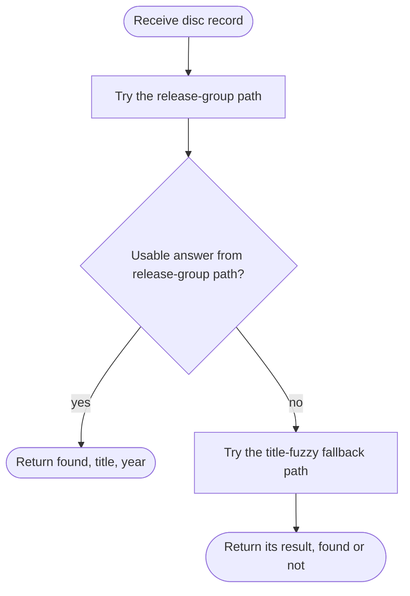
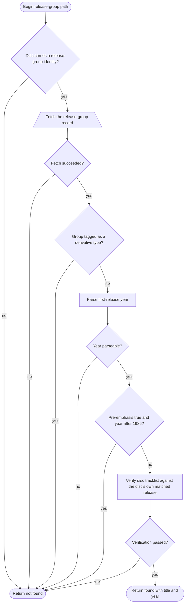
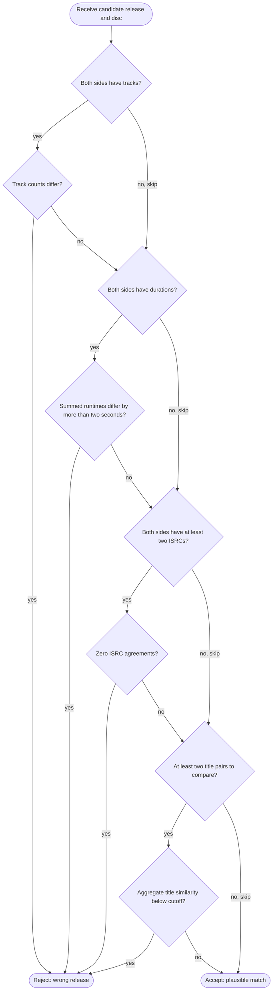
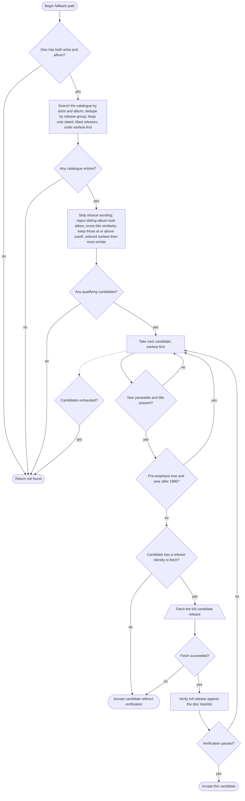

# Original-Release Lookup

> **Purpose**: Determine the earliest known release year and title of the album on a disc, preferring no answer over a wrong answer.

## Overview

This module answers one question about a disc: what is the earliest release of the same logical album, and what was it called? It tries two paths in order. The primary path uses the disc's release-group identity (committed earlier by the MusicBrainz lookup step or a cross-reference): if that group is a genuine studio album — not a compilation, live recording, remix, or other derivative — its first-release date and title are the authoritative answer, but only after the disc's tracklist is verified against its own matched release. The fallback path, used when there is no usable release-group identity, searches the artist's catalogue by title text, strips reissue wording, rejects sibling-album look-alikes, scores titles for similarity, and verifies each surviving candidate against the disc before accepting the earliest one. Throughout, the governing principle is conservatism: any hard contradiction rejects, but missing evidence never does.

## Invariants and Constraints

- **Prefer no answer over a wrong answer.** Every verification gate is "innocent until proven guilty": it can only *reject* on positive evidence of mismatch; missing data (no titles, no durations, no ISRCs, a failed network call) never rejects.
- **A derivative release-group is never accepted as an "original."** Groups tagged compilation, live, remix, DJ-mix, mixtape/street, demo, interview, audiobook, audio drama, or spoken-word are rejected, because their earliest date is the earliest date of the derivative, not of the underlying album.
- **Pre-emphasis caps the candidate year.** A disc carrying pre-emphasis is almost certainly an early-1980s pressing; any candidate year after 1986 is rejected on both the primary and fallback paths, because a later year describes a digital-era reissue that would not carry pre-emphasis.
- **The release-group answer must survive a four-gate tracklist verification** against the disc's own matched release. The four gates are: exact track-count match, summed-runtime agreement within two seconds, per-track ISRC agreement, and aggregate per-track title similarity at or above the title cutoff. Each gate skips when either side lacks the evidence it needs.
- **The two similarity cutoffs are intentionally different and must not be unified.** Album-title candidate *selection* in the fallback uses a higher cutoff; the per-tracklist aggregate title gate inside verification uses a lower cutoff. They score different inputs for different purposes.
- **Runtime comparison is on the summed duration of all tracks**, with a tolerance of two seconds, converting disc frame durations to milliseconds at 75 frames per second.
- **The fallback only runs when the disc carries both an artist and an album title.**
- **Fallback candidates are deduplicated by release-group and ordered earliest-first**, and a candidate must carry a non-blank earliest-release date and a title to be considered.
- **Earliest-match wins, similarity breaks ties.** Among qualifying fallback candidates the earliest year is chosen; equal years are broken by higher similarity.
- **This module performs the lookup only; assignment is separate.** The convenience wrapper that writes the result onto the disc skips entirely when the user has already set the original-release field by hand — manual overrides win.
- **Network failure is never evidence of mismatch.** When a verification fetch fails, the candidate stands.

## Data Shapes

| Direction | Shape | Notes |
|-----------|-------|-------|
| Input | A disc record carrying: album title, artist, optional release-group identity, optional release identity, disc number, a pre-emphasis flag (true / false / not-captured), and a track list with per-track titles, durations (in 75 Hz frames), and optional ISRCs. | The pre-emphasis flag may be "not captured," in which case the year cap does not apply. |
| Output | A trio: a found flag, a title (or none), and a year (or none). The trio is always populated together; found-false means no usable answer was produced. | Found-false is *not* a guarantee that no earlier release exists. |
| Side effect (wrapper only) | When found, the disc's original-release found flag, title, and year are assigned. | Skipped when a manual value is already present. |

## Two-Path Lookup Flowchart

## Release-Group Path Flowchart

## Tracklist Verification Flowchart (four gates)

## Title-Fuzzy Fallback Flowchart

## Step Descriptions

### Two-Path Lookup
1. **Try the release-group path** — the primary, authoritative route.
2. **Usable answer from release-group path?** — if it produced a found answer, return it.
3. **Try the title-fuzzy fallback path** — used only when the primary path produced nothing.

### Release-Group Path
1. **Disc carries a release-group identity?** — without one, this path cannot run.
2. **Fetch the release-group record** — retrieve the group's type tags, title, and first-release date. A failed fetch ends the path (no evidence to reject the eventual fallback).
3. **Group tagged as a derivative type?** — reject compilations, live records, remixes, and similar.
4. **Parse first-release year** — extract the four-digit year; an unparseable date ends the path.
5. **Pre-emphasis true and year after 1986?** — reject a late year on a pre-emphasis disc.
6. **Verify disc tracklist against the disc's own matched release** — fetch the disc's matched release and run the four-gate check; on failure the release-group identification is treated as wrong upstream.
7. **Return found** — title (the group title, or the disc album as a backstop) and year.

### Tracklist Verification (four gates)
1. **Track count** — when both sides have tracks, a differing count rejects; it is the strongest single signal.
2. **Summed runtimes** — when both sides have durations, a summed difference over two seconds rejects.
3. **ISRC overlap** — when both sides carry at least two ISRCs, zero agreements rejects.
4. **Aggregate title similarity** — when at least two title pairs can be compared, an aggregate similarity below the cutoff rejects.
5. **Accept** — reached when no gate produced positive evidence of a mismatch.

### Title-Fuzzy Fallback
1. **Disc has both artist and album?** — required to search.
2. **Search the catalogue** — text search by artist and album; dedupe by release-group; keep only dated, titled releases; order earliest-first.
3. **Strip reissue wording and reject look-alikes** — normalise titles (remove reissue/edition tokens, year qualifiers, disc tags), reject sibling albums (different volume/part numbers, roman-numeral suffixes, live-versus-studio, re-recordings), score title similarity, and keep those at or above the selection cutoff.
4. **Take next candidate, earliest first** — iterate in earliest-then-most-similar order.
5. **Year parseable and title present?** — skip candidates lacking either.
6. **Pre-emphasis cap** — skip a late year on a pre-emphasis disc.
7. **Candidate has a release identity to fetch?** — without one, no verification is possible, so accept on the no-evidence rule.
8. **Fetch the full candidate release** — search results lack per-track data; only the full release can be gated meaningfully. A failed fetch accepts the candidate.
9. **Verify full release against the disc tracklist** — run the four gates; accept the first candidate that passes, else continue.

## Error Handling

| Failure | Trigger | Response | Caller receives |
|---------|---------|----------|-----------------|
| No release-group identity | Disc lacks the identity | Skip primary path | Falls through to fallback |
| Release-group fetch fails | Service or network error | Treat primary path as no answer | Falls through to fallback |
| Derivative group | Group tagged compilation/live/etc. | Reject primary path | Falls through to fallback |
| Unparseable year | First-release date has no year | Reject the path/candidate | Falls through / next candidate |
| Pre-emphasis year conflict | Pre-emphasis disc, candidate year after 1986 | Reject the path/candidate | Falls through / next candidate |
| Verification mismatch | A gate finds positive contradiction | Reject the path/candidate | Falls through / next candidate |
| Verification fetch fails | Disc's release / candidate fetch errors | Treat as no evidence; candidate stands | Accept (no rejection) |
| Missing evidence in a gate | One side lacks tracks/durations/ISRCs/titles | Skip that gate | No effect on outcome |
| No artist or album | Disc lacks search inputs | Skip fallback | Not found |
| Empty catalogue search | No releases returned | Skip fallback | Not found |
| No qualifying candidates | None pass deny-list and similarity cutoff | Stop | Not found |
| Manual override present | User already set the field (wrapper only) | Skip the whole lookup | Disc left as the user set it |

## Algorithm Notes

### Title normalisation
- **Objective**: reduce two album titles to comparable stems so that reissues match their originals while genuinely different albums do not.
- **Decision**: strip year qualifiers, disc tags, and a long allow-list of reissue/edition tokens (longest tokens first so a longer phrase is not partially eaten); remove any remaining bracketed text; drop a leading article; strip punctuation; collapse whitespace; lowercase.

### Deny-list (sibling-album rejection)
- **Objective**: prevent a near-identical title from matching the wrong album in the same series.
- **Decision**: reject when either title is a re-recording; reject a live/studio asymmetry; reject differing or asymmetric roman-numeral suffixes; reject differing arabic-numeral suffixes; reject differing volume/part numbers (numeric, roman, and spelled-out forms are all normalised to integers for comparison).

### Title similarity scoring
- **Objective**: measure how alike two normalised titles are, independent of word order.
- **Decision**: an order-independent token-set similarity score on a 0–100 scale; candidates qualify at or above the selection cutoff; the per-tracklist verification gate uses a separate, lower aggregate cutoff over paired track titles.

### Four-gate verification
- **Objective**: confirm a candidate release plausibly describes the physical disc, rejecting only on hard contradiction.
- **Decision variables / gates**: track-count equality; summed-runtime agreement within two seconds; per-track ISRC agreement (reusing the ISRC-scoring helper from the lookup module); aggregate per-track title similarity.
- **Constraints**: each gate skips when either side lacks the relevant evidence; a single gate's positive contradiction rejects the whole candidate.

## Connects To

- **The disc record / container model** — receives a disc; the wrapper assigns the found title and year back onto it.
- **The shared lookup-result model** — consumes parsed release and track descriptions.
- **The MusicBrainz lookup module** — calls its single-release fetch (for verification), its text search and query builder (for the fallback catalogue), its ISRC-scoring helper (for gate three), and its request-setup helper; consumes the release-group identity and release identity that module commits.
- **The order-independent title-similarity scorer** — used for candidate selection and the title gate.
- **The pipeline finalization / metadata menu** — calls the assignment wrapper, which respects manual overrides.

## Logic clarity / correctness observations

1. **A defined-but-unused per-track duration tolerance constant.** A constant for a per-track duration tolerance of roughly two CD frames is declared but referenced nowhere; the runtime gate compares only *summed* durations against a two-second tolerance. This strongly implies an intended per-track duration gate that was never wired in (or was deliberately replaced by the sum gate). It is harmless but misleading — a reader will look for a per-track comparison that does not exist. Confirmed by search: the constant has no other reference in source or tests.

2. **The release-group verification gate cannot fire on the unresolved-multiple-match path.** The primary-path verification fetches and checks the disc's *own matched release* only when the disc carries a release identity. The MusicBrainz module's agreed-facts path deliberately leaves the release identity blank. So when a disc reached its release-group identity through an unresolved multiple match, the verification returns "pass" without fetching or comparing anything, and the release-group's first-release year is accepted on no tracklist evidence at all. The risk is narrower than it first looks: on that path the release-group was the *majority-agreed* group across the candidates, and the first-release date is a release-group-level fact — only the specific *pressing* was left undetermined, and the year does not depend on it. So the missing track-count gate is less load-bearing here than on a single-match path. Still worth confirming the trade-off is intended, since the strongest guard structurally cannot run precisely when no release identity was committed.

3. **Two parallel fuzzy implementations exist; one is dead and one is test-only.** The path actually used (the verify-each-candidate loop) relies on a candidate-gathering helper that returns full release descriptions and a qualifier that returns *all* passing candidates. A second, older single-best-pick helper is no longer called by any production code — only by tests — and the catalogue helper it pairs with (the tuple-returning gather) has no caller anywhere, production or test. This is redundant surface area that invites a maintainer to edit the wrong function. Recommend the source owners retire the dead pair (no change made here).

4. **The fallback's "keep only dated releases" rule depends on the search response carrying release-group first-release dates.** Candidates lacking an earliest-release date are dropped before scoring. If the catalogue text search does not populate that date field on its lighter-weight search results, the fallback would gather nothing and always return not-found. The tests exercise this path with the date pre-populated on mocked results, so the live behaviour is not covered. This is a verify-against-the-live-service item, not a confirmed defect — flagged so a porter validates the search response shape rather than assuming the date is always present.

5. **The two title cutoffs are intentionally different — do not unify them.** Candidate *selection* uses the higher cutoff on whole album titles; the verification gate uses a lower aggregate cutoff over paired per-track titles. They score different things. A reader noticing the mismatch might "fix" them to agree; that would be a regression. Noted so the distinction is explicit.

6. **The ordering of guards on the fallback is sound.** Cheap local checks (year parse, pre-emphasis cap) run before the costly per-candidate network verification, and the loop stops at the first verified candidate — earliest-first — so the earliest plausible release is returned without over-fetching. No issue.
